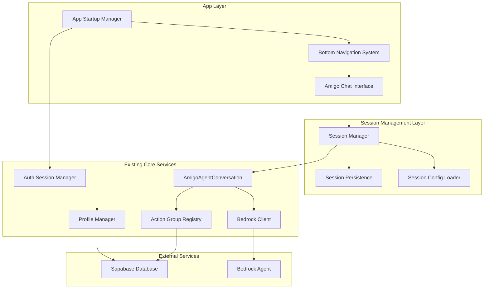
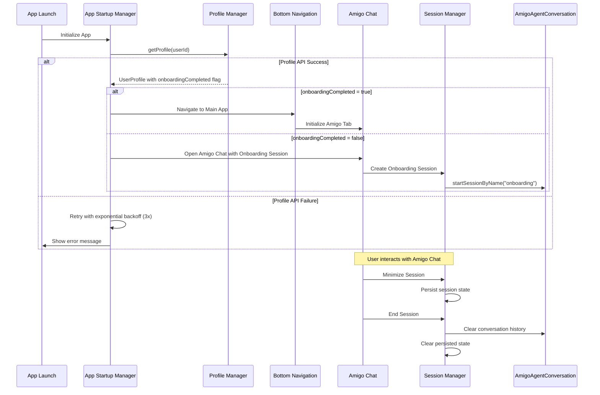

# Design Document: App Startup Flow and Amigo Chat Integration

## Overview

This design document outlines the implementation of an enhanced app startup flow with profile-based onboarding checks and a comprehensive bottom navigation system featuring an integrated Amigo chat interface. The system builds upon existing authentication, profile management, and Bedrock agent infrastructure while introducing new session management capabilities for conversational AI interactions.

### Key Features

- **Enhanced App Startup Flow**: Automatic profile checking and onboarding flag validation
- **Bottom Navigation System**: Three-tab navigation (Home, Profile, Amigo) with persistent state
- **Amigo Chat Interface**: Full-featured conversational AI using existing AmigoAgentConversation class
- **Session Management System**: New session, minimize, end session capabilities with state persistence
- **Onboarding Integration**: Seamless transition from onboarding to main app experience
- **Error Handling**: Robust error recovery and retry mechanisms

### Design Principles

1. **Leverage Existing Architecture**: Build upon proven components like AmigoAgentConversation, ProfileManager, and BedrockClient
2. **Platform Consistency**: Maintain native iOS and Android user experience patterns
3. **State Persistence**: Ensure session state survives app lifecycle events
4. **Performance Optimization**: Fast startup times and responsive interactions
5. **Error Resilience**: Graceful handling of network issues and edge cases

## Architecture

### System Architecture Overview



### Component Interaction Flow



## Components and Interfaces

### 1. App Startup Manager

**Purpose**: Orchestrates the app initialization sequence and determines the appropriate entry point based on user profile status.

#### Interface Definition

```kotlin
interface AppStartupManager {
    suspend fun initialize(): StartupResult
    suspend fun checkOnboardingStatus(userId: String): OnboardingStatus
    suspend fun handleStartupError(error: Throwable): StartupResult
}

data class StartupResult(
    val destination: StartupDestination,
    val userProfile: UserProfile?,
    val error: String? = null
)

enum class StartupDestination {
    MAIN_APP_WITH_NAVIGATION,
    AMIGO_CHAT_ONBOARDING,
    ERROR_RETRY
}

enum class OnboardingStatus {
    COMPLETED,
    PENDING,
    ERROR
}
```

#### Implementation Strategy

```kotlin
class AppStartupManagerImpl(
    private val profileManager: ProfileManager,
    private val sessionManager: SessionManager
) : AppStartupManager {
    
    companion object {
        private const val MAX_RETRIES = 3
        private const val RETRY_DELAY_MS = 3000L
        private const val STARTUP_TIMEOUT_MS = 5000L
    }
    
    override suspend fun initialize(): StartupResult {
        return withTimeout(STARTUP_TIMEOUT_MS) {
            val userId = sessionManager.getCurrentUser()?.id
                ?: return@withTimeout StartupResult(
                    destination = StartupDestination.ERROR_RETRY,
                    userProfile = null,
                    error = "User not authenticated"
                )
            
            var lastError: Throwable? = null
            repeat(MAX_RETRIES) { attempt ->
                try {
                    val profile = profileManager.getProfile(userId).getOrThrow()
                    
                    val destination = if (profile.onboardingCompleted) {
                        StartupDestination.MAIN_APP_WITH_NAVIGATION
                    } else {
                        StartupDestination.AMIGO_CHAT_ONBOARDING
                    }
                    
                    return@withTimeout StartupResult(
                        destination = destination,
                        userProfile = profile
                    )
                } catch (e: Exception) {
                    lastError = e
                    if (attempt < MAX_RETRIES - 1) {
                        delay(RETRY_DELAY_MS * (attempt + 1)) // Exponential backoff
                    }
                }
            }
            
            StartupResult(
                destination = StartupDestination.ERROR_RETRY,
                userProfile = null,
                error = lastError?.message ?: "Unknown startup error"
            )
        }
    }
}
```

### 2. Bottom Navigation System

**Purpose**: Provides three-tab navigation interface with persistent state management.

#### Interface Definition

```kotlin
interface BottomNavigationManager {
    val currentTab: StateFlow<NavigationTab>
    val tabHistory: StateFlow<List<NavigationTab>>
    
    fun selectTab(tab: NavigationTab)
    fun getTabState(tab: NavigationTab): TabState
    fun persistTabState()
    fun restoreTabState()
}

enum class NavigationTab {
    HOME,
    PROFILE,
    AMIGO
}

data class TabState(
    val isSelected: Boolean,
    val lastVisited: Long,
    val hasUnreadContent: Boolean = false
)
```

#### Platform-Specific Implementation

**iOS Implementation (SwiftUI)**:
```swift
struct MainTabView: View {
    @StateObject private var navigationManager: BottomNavigationManager
    @State private var selectedTab: NavigationTab = .home
    
    var body: some View {
        TabView(selection: $selectedTab) {
            HomeView()
                .tabItem {
                    Image(systemName: "house")
                    Text("Home")
                }
                .tag(NavigationTab.home)
            
            ProfileView()
                .tabItem {
                    Image(systemName: "person")
                    Text("Profile")
                }
                .tag(NavigationTab.profile)
            
            AmigoView()
                .tabItem {
                    Image(systemName: "face.smiling") // Will be replaced with bot SVG
                    Text("Amigo")
                }
                .tag(NavigationTab.amigo)
        }
        .onChange(of: selectedTab) { newTab in
            navigationManager.selectTab(newTab)
        }
        .onAppear {
            navigationManager.restoreTabState()
        }
        .onDisappear {
            navigationManager.persistTabState()
        }
    }
}
```

**Android Implementation (Jetpack Compose)**:
```kotlin
@Composable
fun MainBottomNavigation(
    navigationManager: BottomNavigationManager,
    onTabSelected: (NavigationTab) -> Unit
) {
    val currentTab by navigationManager.currentTab.collectAsState()
    
    BottomNavigation {
        NavigationTab.values().forEach { tab ->
            BottomNavigationItem(
                icon = {
                    Icon(
                        imageVector = when (tab) {
                            NavigationTab.HOME -> Icons.Default.Home
                            NavigationTab.PROFILE -> Icons.Default.Person
                            NavigationTab.AMIGO -> Icons.Default.Face // Will be replaced with bot icon
                        },
                        contentDescription = tab.name
                    )
                },
                label = { Text(tab.name.lowercase().capitalize()) },
                selected = currentTab == tab,
                onClick = { onTabSelected(tab) }
            )
        }
    }
}
```

### 3. Amigo Chat Interface

**Purpose**: Provides conversational AI interface using existing AmigoAgentConversation class with enhanced session management.

#### Interface Definition

```kotlin
interface AmigoChat {
    val conversationState: StateFlow<ConversationState>
    val messages: StateFlow<List<ConversationMessage>>
    val sessionState: StateFlow<SessionState>
    val isTyping: StateFlow<Boolean>
    
    suspend fun startNewSession(sessionType: SessionType): Result<Unit>
    suspend fun sendMessage(message: String): Result<Unit>
    suspend fun sendQuickReply(option: String): Result<Unit>
    suspend fun minimizeSession(): Result<Unit>
    suspend fun endSession(): Result<Unit>
    suspend fun restoreSession(): Result<Unit>
}

enum class SessionType {
    ONBOARDING,
    GENERAL_CHAT
}

enum class SessionState {
    INACTIVE,
    ACTIVE,
    MINIMIZED,
    ENDED,
    ERROR
}

data class ConversationState(
    val isActive: Boolean,
    val sessionId: String?,
    val sessionType: SessionType?,
    val messageCount: Int,
    val lastActivity: Long
)
```

#### Implementation Strategy

```kotlin
class AmigoChat(
    private val amigoAgentConversation: AmigoAgentConversation,
    private val sessionManager: AmigoSessionManager,
    private val sessionPersistence: SessionPersistence
) : AmigoChat {
    
    private val _sessionState = MutableStateFlow(SessionState.INACTIVE)
    override val sessionState: StateFlow<SessionState> = _sessionState.asStateFlow()
    
    override suspend fun startNewSession(sessionType: SessionType): Result<Unit> {
        return try {
            _sessionState.value = SessionState.ACTIVE
            
            val configName = when (sessionType) {
                SessionType.ONBOARDING -> "onboarding"
                SessionType.GENERAL_CHAT -> "general_chat"
            }
            
            val result = amigoAgentConversation.startSessionByName(configName)
            
            if (result.isSuccess) {
                sessionManager.createSession(sessionType)
                sessionPersistence.saveSessionState(
                    SessionPersistenceData(
                        sessionType = sessionType,
                        state = SessionState.ACTIVE,
                        messages = emptyList(),
                        timestamp = System.currentTimeMillis()
                    )
                )
            } else {
                _sessionState.value = SessionState.ERROR
            }
            
            result
        } catch (e: Exception) {
            _sessionState.value = SessionState.ERROR
            Result.failure(e)
        }
    }
    
    override suspend fun minimizeSession(): Result<Unit> {
        return try {
            _sessionState.value = SessionState.MINIMIZED
            
            val currentMessages = amigoAgentConversation.getMessagesSnapshot()
            sessionPersistence.saveSessionState(
                SessionPersistenceData(
                    sessionType = sessionManager.getCurrentSessionType(),
                    state = SessionState.MINIMIZED,
                    messages = currentMessages,
                    timestamp = System.currentTimeMillis()
                )
            )
            
            Result.success(Unit)
        } catch (e: Exception) {
            Result.failure(e)
        }
    }
    
    override suspend fun endSession(): Result<Unit> {
        return try {
            _sessionState.value = SessionState.ENDED
            
            sessionManager.endCurrentSession()
            sessionPersistence.clearSessionState()
            
            Result.success(Unit)
        } catch (e: Exception) {
            Result.failure(e)
        }
    }
}
```

### 4. Session Management System

**Purpose**: Manages Amigo chat session lifecycle with state persistence across app lifecycle events.

#### Core Components

##### AmigoSessionManager
```kotlin
class AmigoSessionManager {
    private var currentSession: ChatSession? = null
    private val sessionHistory = mutableListOf<ChatSession>()
    
    data class ChatSession(
        val id: String,
        val type: SessionType,
        val startTime: Long,
        val endTime: Long? = null,
        val messageCount: Int = 0,
        val isActive: Boolean = true
    )
    
    fun createSession(type: SessionType): ChatSession {
        val session = ChatSession(
            id = generateSessionId(),
            type = type,
            startTime = System.currentTimeMillis()
        )
        currentSession = session
        sessionHistory.add(session)
        return session
    }
    
    fun endCurrentSession() {
        currentSession?.let { session ->
            val endedSession = session.copy(
                endTime = System.currentTimeMillis(),
                isActive = false
            )
            sessionHistory[sessionHistory.lastIndex] = endedSession
            currentSession = null
        }
    }
    
    private fun generateSessionId(): String {
        return "amigo_session_${System.currentTimeMillis()}_${Random.nextInt(1000, 9999)}"
    }
}
```

##### SessionPersistence
```kotlin
interface SessionPersistence {
    suspend fun saveSessionState(data: SessionPersistenceData)
    suspend fun loadSessionState(): SessionPersistenceData?
    suspend fun clearSessionState()
    suspend fun hasPersistedSession(): Boolean
}

data class SessionPersistenceData(
    val sessionType: SessionType?,
    val state: SessionState,
    val messages: List<ConversationMessage>,
    val timestamp: Long,
    val sessionId: String? = null
)

class SessionPersistenceImpl(
    private val localStorage: LocalStorage
) : SessionPersistence {
    
    companion object {
        private const val SESSION_STATE_KEY = "amigo_session_state"
        private const val MAX_PERSISTED_MESSAGES = 200
    }
    
    override suspend fun saveSessionState(data: SessionPersistenceData) {
        val trimmedData = data.copy(
            messages = data.messages.takeLast(MAX_PERSISTED_MESSAGES)
        )
        localStorage.save(SESSION_STATE_KEY, trimmedData)
    }
    
    override suspend fun loadSessionState(): SessionPersistenceData? {
        return localStorage.load(SESSION_STATE_KEY)
    }
    
    override suspend fun clearSessionState() {
        localStorage.remove(SESSION_STATE_KEY)
    }
    
    override suspend fun hasPersistedSession(): Boolean {
        return localStorage.exists(SESSION_STATE_KEY)
    }
}
```

## Data Models

### Enhanced Session Configuration

Building upon the existing SessionConfig system, we'll add new configurations for general chat:

```kotlin
// New session configuration for general chat
object GeneralChatSessionConfig {
    val config = SessionConfig(
        cap = "general_chat",
        responsibilities = listOf(
            "Provide helpful guidance on health and fitness topics",
            "Answer questions about nutrition and meal planning",
            "Assist with goal tracking and progress monitoring",
            "Offer motivational support and encouragement",
            "Help interpret health metrics and data",
            "Suggest actionable steps for goal achievement"
        ),
        collectData = listOf(
            "user_questions",
            "topics_of_interest",
            "current_challenges"
        ),
        collectMetrics = listOf(
            "engagement_level",
            "satisfaction_rating"
        ),
        initialMessage = "Hi! I'm Amigo, your health and fitness assistant. How can I help you today?",
        notes = listOf(
            "Maintain a friendly and supportive tone",
            "Provide evidence-based health information",
            "Encourage users to consult healthcare professionals for medical advice",
            "Focus on actionable, practical guidance"
        )
    )
}
```

### Session State Models

```kotlin
@Serializable
data class AmigoSessionState(
    val sessionId: String,
    val sessionType: SessionType,
    val state: SessionState,
    val conversationHistory: List<ConversationMessage>,
    val profileData: Map<String, String> = emptyMap(),
    val createdAt: Long,
    val lastActivity: Long,
    val messageCount: Int,
    val isMinimized: Boolean = false
)

@Serializable
data class SessionMetrics(
    val sessionDuration: Long,
    val messageCount: Int,
    val userEngagement: Double,
    val completionRate: Double,
    val errorCount: Int
)
```

### Navigation State Models

```kotlin
@Serializable
data class NavigationState(
    val currentTab: NavigationTab,
    val tabHistory: List<NavigationTab>,
    val lastTabChange: Long,
    val tabStates: Map<NavigationTab, TabState>
)

@Serializable
data class TabState(
    val isSelected: Boolean,
    val lastVisited: Long,
    val hasUnreadContent: Boolean = false,
    val badgeCount: Int = 0
)
```

## Correctness Properties

*A property is a characteristic or behavior that should hold true across all valid executions of a system-essentially, a formal statement about what the system should do. Properties serve as the bridge between human-readable specifications and machine-verifiable correctness guarantees.*

Based on the prework analysis, I've identified the testable acceptance criteria and will now convert them into universally quantified properties. After reviewing all properties for redundancy, I've consolidated overlapping properties to ensure each provides unique validation value.

### Property 1: App Startup Profile API Call

*For any* app launch event, the App_Startup_Manager should call the Profile_API to retrieve user profile data before proceeding with navigation decisions.

**Validates: Requirements 1.1**

### Property 2: Onboarding Flag Navigation Decision

*For any* successful Profile_API response, if the onboarding_completed flag is true, the App_Startup_Manager should navigate to the main app with Bottom_Navigation_System, otherwise it should open the Amigo_Chat_Interface with Onboarding_Session configuration.

**Validates: Requirements 1.2, 1.3, 1.4**

### Property 3: Profile API Retry with Exponential Backoff

*For any* Profile_API failure during startup, the App_Startup_Manager should retry up to 3 times with exponential backoff (3 seconds base delay), displaying error messages and providing retry options.

**Validates: Requirements 1.5, 7.1**

### Property 4: Startup Performance Guarantee

*For any* app launch under normal network conditions, the App_Startup_Manager should complete the startup sequence within 5 seconds.

**Validates: Requirements 1.6**

### Property 5: Bottom Navigation Tab Selection

*For any* tab selection in the Bottom_Navigation_System, the system should highlight the active tab, navigate to the corresponding screen, and respond within 200 milliseconds.

**Validates: Requirements 2.5, 8.3**

### Property 6: Navigation State Persistence

*For any* app session, the Bottom_Navigation_System should persist the selected tab state during the session and maintain accessibility from all main app screens.

**Validates: Requirements 2.6, 2.7**

### Property 7: Amigo Chat Session Creation

*For any* opening of the Amigo_Chat_Interface, the system should start a new session with the Bedrock_Agent using the appropriate session configuration (Onboarding_Session or General_Chat_Session).

**Validates: Requirements 3.2, 3.3, 5.1**

### Property 8: Chat Message Exchange

*For any* message sent through the Amigo_Chat_Interface, the system should provide real-time exchange with the Bedrock_Agent, display conversation history within the current session, and handle sending, receiving, and error states appropriately.

**Validates: Requirements 3.4, 3.5, 3.6**

### Property 9: Session State Management

*For any* session operation (minimize, end, restore), the Session_Manager should preserve or clear session state appropriately: minimizing preserves state and conversation history, ending clears all data, and restoring returns to the previous state.

**Validates: Requirements 4.1, 4.2, 4.3, 4.4, 4.5, 4.6**

### Property 10: App Lifecycle State Persistence

*For any* app backgrounding or foregrounding event, the Session_Manager should persist session state to local storage when backgrounded and restore it when foregrounded, while preserving session state during tab navigation.

**Validates: Requirements 4.7, 6.1, 6.2, 6.4**

### Property 11: Onboarding Integration

*For any* onboarding completion through chat, the system should update the Onboarding_Flag to true, support all existing onboarding data collection functions, and navigate to the main app with Bottom_Navigation_System.

**Validates: Requirements 5.2, 5.3, 5.4, 5.5**

### Property 12: Session History Management

*For any* session with conversation history, the Session_Manager should maintain history for active and minimized sessions, limit stored history to 200 messages per session for memory optimization, and load history within 1 second for sessions under 100 messages.

**Validates: Requirements 6.3, 8.2, 8.6**

### Property 13: Error Handling and Recovery

*For any* system error (Bedrock_Agent connection failure, session restoration failure, action group function failure), the system should display appropriate error messages, provide retry options, and implement fallback behavior (creating new sessions when restoration fails).

**Validates: Requirements 7.2, 7.3, 7.5**

### Property 14: Network Interruption Handling

*For any* network interruption during chat sessions, the Session_Manager should queue messages and send them when connection is restored.

**Validates: Requirements 7.4**

### Property 15: Offline Mode Support

*For any* offline state, the App_Startup_Manager should provide access to previously loaded profile data.

**Validates: Requirements 7.6**

### Property 16: UI Feedback and Performance

*For any* user interaction requiring processing time, the system should display appropriate feedback: typing indicators during Bedrock_Agent processing, loading indicators during Profile_API calls, and support message pagination for conversations exceeding 50 messages.

**Validates: Requirements 8.1, 8.4, 8.5**

## Error Handling

### Error Categories and Recovery Strategies

#### 1. Network and API Errors

**Profile API Failures**:
- **Retry Strategy**: Exponential backoff with 3 attempts (3s, 6s, 12s delays)
- **User Feedback**: Loading indicators with progress messages
- **Fallback**: Offline mode with cached profile data
- **Recovery**: Automatic retry on network restoration

**Bedrock Agent Connection Failures**:
- **Immediate Response**: Display connection error message
- **User Options**: Manual retry button, offline mode suggestion
- **Fallback**: Queue messages for later delivery
- **Recovery**: Automatic reconnection attempt every 30 seconds

#### 2. Session Management Errors

**Session Restoration Failures**:
- **Detection**: Corrupted or incompatible session data
- **Response**: Create new session with user notification
- **Data Recovery**: Attempt to salvage conversation history
- **User Choice**: Option to start fresh or retry restoration

**State Persistence Failures**:
- **Local Storage Issues**: Fallback to in-memory storage
- **Data Corruption**: Clear corrupted data and start fresh
- **Quota Exceeded**: Implement data cleanup and compression
- **User Notification**: Inform about storage limitations

#### 3. UI and Performance Errors

**Timeout Handling**:
- **Startup Timeout**: 5-second limit with progress indication
- **Message Response Timeout**: 30-second limit with retry option
- **Tab Navigation Timeout**: 200ms limit with immediate feedback

**Memory Management**:
- **Message History Limits**: 200 messages per session
- **Automatic Cleanup**: Remove old sessions and data
- **Performance Monitoring**: Track memory usage and optimize

#### 4. Platform-Specific Error Handling

**iOS Error Handling**:
```swift
class ErrorHandler {
    static func handleStartupError(_ error: StartupError) -> StartupRecoveryAction {
        switch error {
        case .profileAPIFailure(let attempts):
            if attempts < 3 {
                return .retryWithDelay(calculateBackoffDelay(attempts))
            } else {
                return .showOfflineMode
            }
        case .sessionRestoreFailure:
            return .createNewSession(notifyUser: true)
        case .networkTimeout:
            return .showRetryOption
        }
    }
}
```

**Android Error Handling**:
```kotlin
class ErrorHandler {
    companion object {
        fun handleStartupError(error: StartupError): StartupRecoveryAction {
            return when (error) {
                is StartupError.ProfileAPIFailure -> {
                    if (error.attempts < 3) {
                        StartupRecoveryAction.RetryWithDelay(calculateBackoffDelay(error.attempts))
                    } else {
                        StartupRecoveryAction.ShowOfflineMode
                    }
                }
                is StartupError.SessionRestoreFailure -> {
                    StartupRecoveryAction.CreateNewSession(notifyUser = true)
                }
                is StartupError.NetworkTimeout -> {
                    StartupRecoveryAction.ShowRetryOption
                }
            }
        }
    }
}
```

### Error Monitoring and Analytics

**Error Tracking**:
- Log all errors with context and user impact
- Track error frequency and patterns
- Monitor recovery success rates
- Collect user feedback on error experiences

**Performance Metrics**:
- Startup time distribution
- API response times
- Session restoration success rates
- User engagement after errors

## Testing Strategy

### Dual Testing Approach

The testing strategy employs both unit testing and property-based testing to ensure comprehensive coverage:

- **Unit Tests**: Verify specific examples, edge cases, and error conditions
- **Property Tests**: Verify universal properties across all inputs
- **Integration Tests**: Verify component interactions and end-to-end flows

### Unit Testing Strategy

**Focus Areas**:
- Specific startup flow scenarios (onboarding complete/incomplete)
- Error handling edge cases (network failures, corrupted data)
- UI component behavior (tab selection, navigation)
- Platform-specific implementations (iOS/Android differences)

**Key Test Cases**:
```kotlin
// Example unit tests
class AppStartupManagerTest {
    @Test
    fun `startup with completed onboarding navigates to main app`()
    
    @Test
    fun `startup with incomplete onboarding opens chat interface`()
    
    @Test
    fun `profile API failure triggers retry with exponential backoff`()
    
    @Test
    fun `startup timeout shows error message after 5 seconds`()
}

class BottomNavigationTest {
    @Test
    fun `selecting home tab navigates to home screen`()
    
    @Test
    fun `tab selection highlights active tab within 200ms`()
    
    @Test
    fun `navigation state persists during app session`()
}
```

### Property-Based Testing Configuration

**Testing Library**: Use Kotest Property Testing for Kotlin Multiplatform
**Minimum Iterations**: 100 per property test
**Test Tagging**: Each property test references its design document property

**Property Test Examples**:
```kotlin
class AppStartupPropertyTests : StringSpec({
    
    "Property 1: App Startup Profile API Call" {
        checkAll<UserProfile>(100) { profile ->
            // Feature: app-startup-and-amigo-chat, Property 1: App Startup Profile API Call
            val startupManager = createStartupManager()
            val result = startupManager.initialize()
            
            verify { profileManager.getProfile(any()) }
        }
    }
    
    "Property 5: Bottom Navigation Tab Selection" {
        checkAll<NavigationTab>(100) { tab ->
            // Feature: app-startup-and-amigo-chat, Property 5: Bottom Navigation Tab Selection
            val navigationManager = createNavigationManager()
            val startTime = System.currentTimeMillis()
            
            navigationManager.selectTab(tab)
            
            val responseTime = System.currentTimeMillis() - startTime
            responseTime shouldBeLessThan 200
            navigationManager.currentTab.value shouldBe tab
        }
    }
    
    "Property 9: Session State Management" {
        checkAll<SessionType, List<ConversationMessage>>(100) { sessionType, messages ->
            // Feature: app-startup-and-amigo-chat, Property 9: Session State Management
            val sessionManager = createSessionManager()
            
            // Test minimize preserves state
            sessionManager.createSession(sessionType)
            messages.forEach { sessionManager.addMessage(it) }
            
            sessionManager.minimizeSession()
            val minimizedState = sessionManager.getSessionState()
            
            minimizedState.messages shouldContainAll messages
            minimizedState.state shouldBe SessionState.MINIMIZED
            
            // Test end clears state
            sessionManager.endSession()
            val endedState = sessionManager.getSessionState()
            
            endedState.messages shouldBe emptyList()
            endedState.state shouldBe SessionState.ENDED
        }
    }
})
```

### Integration Testing

**End-to-End Scenarios**:
1. **Complete Onboarding Flow**: New user → profile check → onboarding chat → completion → main app
2. **Returning User Flow**: Existing user → profile check → main app → Amigo chat
3. **Session Persistence Flow**: Start chat → minimize → background app → restore → continue chat
4. **Error Recovery Flow**: Network failure → retry → success → continue normal operation

**Platform Testing**:
- iOS: XCTest with UI testing for SwiftUI components
- Android: Espresso with Compose testing for UI components
- Shared: Kotlin Multiplatform tests for business logic

### Performance Testing

**Benchmarks**:
- App startup time: < 5 seconds (95th percentile)
- Tab navigation response: < 200ms (99th percentile)
- Chat message response: < 2 seconds (90th percentile)
- Session restoration: < 1 second for < 100 messages

**Load Testing**:
- Large conversation histories (200+ messages)
- Multiple concurrent sessions
- Rapid tab switching
- Background/foreground cycling

### Test Data Management

**Mock Data Generation**:
```kotlin
object TestDataGenerator {
    fun generateUserProfile(onboardingCompleted: Boolean = Random.nextBoolean()): UserProfile
    fun generateConversationMessages(count: Int): List<ConversationMessage>
    fun generateSessionState(type: SessionType): SessionState
}
```

**Test Environment Setup**:
- Mock Bedrock Agent responses
- Simulated network conditions
- Controlled timing for performance tests
- Isolated storage for state persistence tests

This comprehensive testing strategy ensures that all correctness properties are validated through both specific examples and universal property verification, providing confidence in the system's reliability and performance across all usage scenarios.