# Design Document: Amigo

## Overview

Amigo is an AI-first personal health coaching application centered around "Amigo", an intelligent AI health mentor powered by Claude AI through Amazon Bedrock. The system enables comprehensive health tracking through multiple input methods (image, voice, text) for meal logging, water intake tracking, and intermittent fasting management. The application uses Supabase as its backend infrastructure and implements a two-tier subscription model (Free, Pro) with progressively enhanced features.

### Core Value Proposition

- AI-powered meal logging with image, voice, and text input
- Personalized health coaching that evolves with each user through context accumulation
- Seamless integration with major health platforms (Fitbit, Garmin, Apple Health, Google Health Connect)
- Comprehensive nutritional data from USDA FoodData Central and barcode scanning
- Water intake and intermittent fasting tracking with intelligent reminders
- Real-time data synchronization across devices

### Key Design Principles

1. **AI-First Experience**: Claude AI powers all intelligent features, from meal analysis to personalized coaching
2. **Progressive Personalization**: User context accumulates over time, making Amigo increasingly knowledgeable
3. **Privacy by Design**: Row-level security, encrypted storage, and GDPR compliance
4. **Graceful Degradation**: Core features remain functional when external services are unavailable
5. **Real-time Synchronization**: Supabase Realtime ensures data consistency across devices
6. **Subscription-Based Access**: Features scale with subscription tier while maintaining free tier value

## Architecture

### High-Level System Architecture

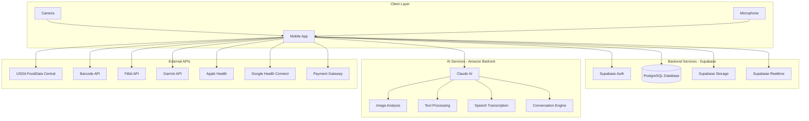

### Architecture Layers

#### 1. Client Layer (Mobile App)
- Cross-platform mobile application (iOS/Android)
- Handles user interface and local state management
- Manages device permissions (camera, microphone, notifications, health data)
- Implements offline-first data caching
- Handles real-time updates via Supabase Realtime subscriptions

#### 2. Backend Layer (Supabase)
- **Authentication**: Email/password, Google OAuth, Apple OAuth
- **Database**: PostgreSQL with Row-Level Security policies
- **Storage**: Food photos and media files
- **Realtime**: Live data synchronization across devices
- **Edge Functions**: Server-side business logic (if needed)

#### 3. AI Layer (Amazon Bedrock + Claude)
- **Image Analysis**: Food identification and nutritional estimation from photos
- **Text Processing**: Natural language meal description parsing
- **Speech Transcription**: Voice-to-text conversion for meal logging
- **Conversation Engine**: Powers Amigo's coaching conversations
- **Insight Generation**: Analyzes patterns and generates personalized insights
- **Pattern Analysis**: Identifies user behavior patterns over time

#### 4. Integration Layer (External APIs)
- **USDA FoodData Central**: Verified nutritional information
- **Barcode APIs**: Product identification from UPC/EAN codes
- **Health Platforms**: Fitbit, Garmin, Apple Health, Google Health Connect
- **Payment Gateway**: Subscription and payment processing

### Data Flow Architecture

#### Meal Logging Flow (Image-Based)

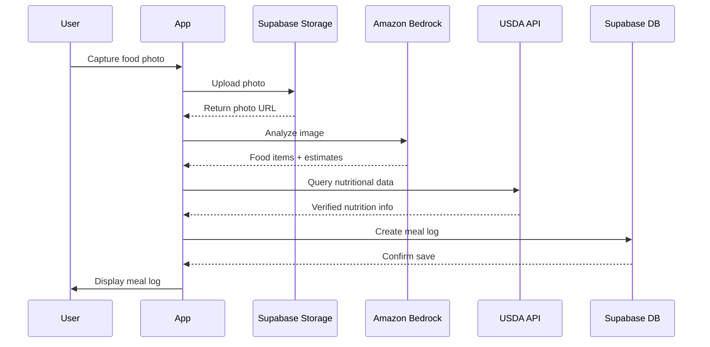


#### Amigo Conversation Flow (Pro Tier)

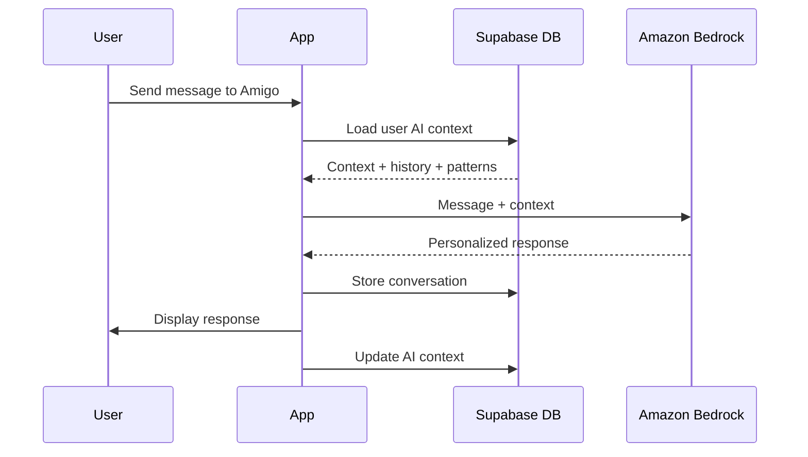

#### Health Platform Sync Flow

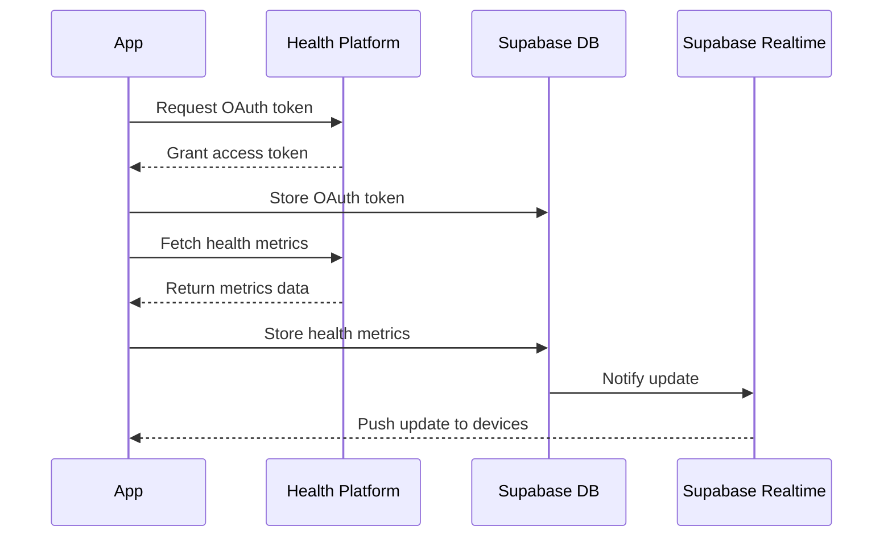

### Security Architecture

#### Authentication Flow

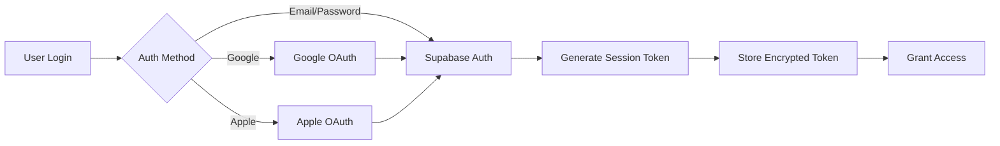

#### Row-Level Security (RLS) Model

All user data tables implement RLS policies that restrict access based on the authenticated user's ID:

- **Meal Logs**: Users can only access their own meal records
- **Water Logs**: Users can only access their own water records
- **Fasting Sessions**: Users can only access their own fasting records
- **Health Metrics**: Users can only access their own synced health data
- **AI Context**: Users can only access their own AI context and conversation history
- **Subscription Records**: Users can only access their own subscription data
- **Food Photos**: Storage policies ensure users can only access their own photos

## Components and Interfaces

### Mobile App Components

#### 1. Authentication Module
- **EmailAuthenticator**: Handles email/password authentication via Supabase Auth
- **GoogleAuthenticator**: Manages Google OAuth flow
- **AppleAuthenticator**: Manages Apple Sign In flow
- **SessionManager**: Maintains session tokens and handles token refresh

#### 2. Meal Logging Module
- **ImageLogger**: Captures photos, uploads to storage, triggers AI analysis
- **VoiceLogger**: Records audio, transcribes via Claude, parses meal data
- **TextLogger**: Accepts text input, parses via Claude, extracts meal data
- **NutritionEnricher**: Queries USDA API to enhance AI estimates with verified data
- **BarcodeScanner**: Captures and decodes UPC/EAN barcodes
- **MealLogManager**: Coordinates meal log creation and storage

#### 3. Water Tracking Module
- **WaterTracker**: Manages water log creation and goal tracking
- **HydrationProgressCalculator**: Computes daily progress toward water goals
- **WaterReminderScheduler**: Schedules and sends water reminder notifications

#### 4. Fasting Module
- **FastingTracker**: Manages fasting session lifecycle
- **FastingTimer**: Tracks elapsed time during active fasting sessions
- **FastingStreakCalculator**: Computes and maintains fasting streaks
- **FastingNotificationManager**: Sends notifications when fasting goals are reached

#### 5. AI Coaching Module (Pro Tier)
- **ChatInterface**: Displays conversation with Amigo
- **AIConversationEngine**: Manages conversation flow and context loading
- **AIInsightGenerator**: Generates personalized health insights
- **PatternAnalyzer**: Identifies patterns in user behavior
- **PreferenceTracker**: Learns and stores user preferences
- **CoachingAdaptationEngine**: Adjusts coaching style based on user progress


#### 6. Health Platform Integration Module
- **PlatformConnector**: Manages OAuth and API communication with health platforms
- **FitbitIntegration**: Syncs data from Fitbit API
- **GarminIntegration**: Syncs data from Garmin API
- **AppleHealthIntegration**: Syncs data from Apple HealthKit
- **GoogleHealthIntegration**: Syncs data from Google Health Connect
- **MetricStore**: Stores and manages synced health metrics

#### 7. Subscription Module
- **SubscriptionManager**: Manages subscription tier and usage quotas
- **UsageQuotaTracker**: Tracks and enforces meal logging limits
- **PaymentGatewayClient**: Handles payment processing
- **ReceiptGenerator**: Creates and stores transaction receipts
- **TrialManager**: Manages trial period activation and expiration

#### 8. Dashboard Module
- **DashboardController**: Coordinates dashboard data display
- **DailySummaryGenerator**: Computes daily health metrics summary
- **ActivityFeedManager**: Displays recent user activities
- **QuickStatsCalculator**: Computes key statistics and trends

#### 9. Notification Module
- **NotificationScheduler**: Schedules and delivers push notifications
- **DeepLinkHandler**: Processes notification taps and navigates to features
- **NotificationPreferencesManager**: Manages user notification settings
- **PlatformNotificationService**: Platform-specific notification implementation (APNs for iOS, FCM for Android)
- **NotificationPermissionManager**: Handles notification permission requests and status

#### 10. Onboarding Module
- **OnboardingFlowController**: Manages the complete onboarding sequence
- **WelcomeScreenManager**: Displays welcome screens and feature introductions
- **ProfileSetupWizard**: Guides users through profile creation
- **HealthGoalSetupManager**: Assists users in setting initial health goals
- **TutorialManager**: Provides interactive feature tutorials
- **PermissionRequestCoordinator**: Manages device permission requests (camera, notifications, health data)
- **OnboardingStateManager**: Tracks onboarding progress and allows resume from last step

#### 11. Settings Module
- **ProfileManager**: Manages user profile information
- **UnitPreferencesManager**: Handles measurement unit conversions
- **ThemeManager**: Manages light/dark mode
- **LanguageManager**: Handles app localization
- **DataExporter**: Generates data exports in JSON/CSV formats
- **AccountDeletionManager**: Handles account deletion and data removal

### Backend Components (Supabase)

#### Database Tables

**users_profiles**
- id (uuid, primary key, references auth.users)
- name (text)
- age (integer)
- height (numeric)
- weight (numeric)
- unit_preferences (jsonb)
- language_settings (text)
- theme_settings (text)
- water_goal (numeric)
- nutrition_goals (jsonb)
- notification_preferences (jsonb)
- created_at (timestamp)
- updated_at (timestamp)

**meal_logs**
- id (uuid, primary key)
- user_id (uuid, foreign key to users_profiles)
- timestamp (timestamp)
- input_method (enum: image, voice, text, barcode)
- food_items (jsonb array)
- nutritional_data (jsonb)
- photo_url (text, nullable)
- barcode_identifier (text, nullable)
- data_source (enum: usda, barcode_api, ai_estimate)
- confidence_score (numeric, nullable)
- created_at (timestamp)

**water_logs**
- id (uuid, primary key)
- user_id (uuid, foreign key to users_profiles)
- volume (numeric)
- unit (enum: ml, oz, cups, liters)
- timestamp (timestamp)
- created_at (timestamp)

**fasting_sessions**
- id (uuid, primary key)
- user_id (uuid, foreign key to users_profiles)
- start_time (timestamp)
- end_time (timestamp, nullable)
- protocol (enum: 16_8, 18_6, 20_4, custom)
- target_duration (interval)
- actual_duration (interval, nullable)
- completed (boolean)
- created_at (timestamp)

**health_metrics**
- id (uuid, primary key)
- user_id (uuid, foreign key to users_profiles)
- metric_type (enum: steps, heart_rate, sleep, exercise)
- value (numeric)
- unit (text)
- source_platform (enum: fitbit, garmin, apple_health, google_health)
- timestamp (timestamp)
- created_at (timestamp)
- UNIQUE constraint on (user_id, metric_type, source_platform, timestamp)

**subscriptions**
- id (uuid, primary key)
- user_id (uuid, foreign key to users_profiles)
- tier (enum: free, pro)
- billing_frequency (enum: monthly, annual, nullable)
- start_date (timestamp)
- renewal_date (timestamp, nullable)
- trial_end_date (timestamp, nullable)
- status (enum: active, cancelled, expired)
- image_quota_used (integer)
- voice_quota_used (integer)
- text_quota_used (integer)
- created_at (timestamp)
- updated_at (timestamp)

**payment_transactions**
- id (uuid, primary key)
- user_id (uuid, foreign key to users_profiles)
- subscription_id (uuid, foreign key to subscriptions)
- amount (numeric)
- currency (text)
- status (enum: pending, completed, failed, refunded)
- gateway_transaction_id (text)
- transaction_date (timestamp)
- created_at (timestamp)


**user_ai_context**
- id (uuid, primary key)
- user_id (uuid, foreign key to users_profiles)
- pattern_profile (jsonb)
- preferences (jsonb)
- coaching_style (jsonb)
- context_summary (text)
- active_goal_id (uuid, foreign key to health_goals, nullable)
- last_updated (timestamp)
- created_at (timestamp)

**health_goals**
- id (uuid, primary key)
- user_id (uuid, foreign key to users_profiles)
- goal_type (enum: weight_loss, muscle_gain, maintenance, improved_energy, better_sleep)
- start_date (timestamp)
- end_date (timestamp, nullable)
- is_active (boolean)
- goal_context (jsonb)
- created_at (timestamp)
- updated_at (timestamp)

**goal_history**
- id (uuid, primary key)
- user_id (uuid, foreign key to users_profiles)
- goal_id (uuid, foreign key to health_goals)
- goal_type (enum: weight_loss, muscle_gain, maintenance, improved_energy, better_sleep)
- start_date (timestamp)
- end_date (timestamp)
- duration_days (integer)
- summary (text)
- transition_reason (text, nullable)
- outcomes (jsonb)
- created_at (timestamp)

**conversation_history**
- id (uuid, primary key)
- user_id (uuid, foreign key to users_profiles)
- message_type (enum: user, amigo)
- message_content (text)
- timestamp (timestamp)
- feedback_rating (enum: helpful, not_helpful, nullable)
- created_at (timestamp)

**oauth_tokens**
- id (uuid, primary key)
- user_id (uuid, foreign key to users_profiles)
- platform (enum: fitbit, garmin, google_health)
- access_token (text, encrypted)
- refresh_token (text, encrypted, nullable)
- expires_at (timestamp)
- created_at (timestamp)
- updated_at (timestamp)

**custom_foods**
- id (uuid, primary key)
- user_id (uuid, foreign key to users_profiles)
- name (text)
- brand (text, nullable)
- serving_size (numeric)
- serving_unit (text)
- nutritional_data (jsonb)
- notes (text, nullable)
- created_at (timestamp)
- updated_at (timestamp)
- UNIQUE constraint on (user_id, name, brand)

#### Storage Buckets

**food-photos**
- Public access: No
- File size limit: 10MB
- Allowed formats: JPEG, PNG, HEIC
- RLS policies: Users can only upload/access their own photos

### AI Service Interfaces

#### Amazon Bedrock Client

```typescript
interface BedrockClient {
  analyzeImage(imageData: Buffer, userId: string): Promise<FoodAnalysisResult>
  parseTextMeal(text: string, userId: string): Promise<MealParseResult>
  transcribeSpeech(audioData: Buffer, userId: string): Promise<TranscriptionResult>
  generateResponse(message: string, context: UserContext): Promise<AmigoResponse>
  generateInsights(userData: HealthData, context: UserContext): Promise<InsightResult>
  summarizeContext(contextData: AIContext): Promise<ContextSummary>
}

interface FoodAnalysisResult {
  foodItems: Array<{
    name: string
    quantity: string
    confidence: number
  }>
  nutritionalEstimate: NutritionalData
  confidence: number
}

interface MealParseResult {
  foodItems: Array<{
    name: string
    quantity: string
    preparationMethod?: string
  }>
  mealType?: string
  nutritionalEstimate: NutritionalData
}

interface TranscriptionResult {
  text: string
  confidence: number
  language: string
}

interface AmigoResponse {
  message: string
  tone: string
  references: Array<string>
}

interface UserContext {
  conversationHistory: Array<Message>
  patternProfile: PatternProfile
  preferences: UserPreferences
  recentMeals: Array<MealLog>
  recentFasting: Array<FastingSession>
  healthMetrics: Array<HealthMetric>
  goals: HealthGoals
}
```

### External API Interfaces

#### USDA FoodData Central API

```typescript
interface USDAClient {
  searchFoods(query: string): Promise<Array<FoodItem>>
  getFoodDetails(fdcId: string): Promise<FoodDetails>
  getNutrients(fdcId: string): Promise<NutritionalData>
}

interface FoodItem {
  fdcId: string
  description: string
  dataType: string
  category: string
}

interface FoodDetails {
  fdcId: string
  description: string
  nutrients: Array<Nutrient>
  servingSize: number
  servingUnit: string
}
```

#### Barcode API

```typescript
interface BarcodeClient {
  lookupProduct(barcode: string): Promise<ProductInfo>
}

interface ProductInfo {
  barcode: string
  name: string
  brand: string
  nutritionalData: NutritionalData
  servingSize: number
  servingUnit: string
}
```

#### Health Platform APIs

```typescript
interface HealthPlatformClient {
  authenticate(userId: string): Promise<OAuthToken>
  syncMetrics(userId: string, startDate: Date, endDate: Date): Promise<Array<HealthMetric>>
  revokeAccess(userId: string): Promise<void>
}

interface HealthMetric {
  type: MetricType
  value: number
  unit: string
  timestamp: Date
  source: string
}
```

## Data Models

### Core Domain Models

#### User Profile
```typescript
interface UserProfile {
  id: string
  name: string
  age: number
  height: number
  weight: number
  unitPreferences: UnitPreferences
  languageSettings: string
  themeSettings: ThemeSettings
  waterGoal: number
  nutritionGoals: NutritionGoals
  notificationPreferences: NotificationPreferences
  createdAt: Date
  updatedAt: Date
}

interface UnitPreferences {
  system: 'metric' | 'imperial'
  weight: 'kg' | 'lbs'
  height: 'cm' | 'ft_in'
  volume: 'ml' | 'oz' | 'cups' | 'liters'
}

interface NutritionGoals {
  dailyCalories?: number
  protein?: number
  carbohydrates?: number
  fat?: number
  fiber?: number
}
```


#### Meal Log
```typescript
interface MealLog {
  id: string
  userId: string
  timestamp: Date
  inputMethod: 'image' | 'voice' | 'text' | 'barcode'
  foodItems: Array<FoodItem>
  nutritionalData: NutritionalData
  photoUrl?: string
  barcodeIdentifier?: string
  dataSource: 'usda' | 'barcode_api' | 'ai_estimate'
  confidenceScore?: number
  createdAt: Date
}

interface FoodItem {
  name: string
  quantity: string
  unit: string
  fdcId?: string
  preparationMethod?: string
}

interface NutritionalData {
  calories: number
  protein: number
  carbohydrates: number
  fat: number
  fiber?: number
  sugar?: number
  sodium?: number
  micronutrients?: Record<string, number>
}
```

#### Water Log
```typescript
interface WaterLog {
  id: string
  userId: string
  volume: number
  unit: 'ml' | 'oz' | 'cups' | 'liters'
  timestamp: Date
  createdAt: Date
}

interface HydrationProgress {
  date: Date
  totalVolume: number
  goal: number
  percentage: number
  goalMet: boolean
}
```

#### Fasting Session
```typescript
interface FastingSession {
  id: string
  userId: string
  startTime: Date
  endTime?: Date
  protocol: '16_8' | '18_6' | '20_4' | 'custom'
  targetDuration: number // in minutes
  actualDuration?: number // in minutes
  completed: boolean
  createdAt: Date
}

interface FastingStreak {
  currentStreak: number
  longestStreak: number
  lastCompletedDate?: Date
}
```

#### Subscription
```typescript
interface Subscription {
  id: string
  userId: string
  tier: 'free' | 'pro'
  billingFrequency?: 'monthly' | 'annual'
  startDate: Date
  renewalDate?: Date
  trialEndDate?: Date
  status: 'active' | 'cancelled' | 'expired'
  quotas: UsageQuotas
  createdAt: Date
  updatedAt: Date
}

interface UsageQuotas {
  imageLogsLimit: number
  imageLogsUsed: number
  voiceLogsLimit: number
  voiceLogsUsed: number
  textLogsLimit: number
  textLogsUsed: number
}
```

### AI Personalization Models

#### User AI Context
```typescript
interface UserAIContext {
  id: string
  userId: string
  patternProfile: PatternProfile
  preferences: UserPreferences
  coachingStyle: CoachingStyle
  contextSummary: string
  activeGoalId?: string
  lastUpdated: Date
  createdAt: Date
}

interface HealthGoal {
  id: string
  userId: string
  goalType: 'weight_loss' | 'muscle_gain' | 'maintenance' | 'improved_energy' | 'better_sleep'
  startDate: Date
  endDate?: Date
  isActive: boolean
  goalContext: GoalContext
  createdAt: Date
  updatedAt: Date
}

interface GoalContext {
  patterns: {
    mealPatterns: GoalSpecificMealPatterns
    fastingPatterns: GoalSpecificFastingPatterns
    hydrationPatterns: GoalSpecificHydrationPatterns
  }
  progress: {
    metrics: Record<string, number>
    milestones: Array<Milestone>
    trends: Array<Trend>
  }
  coachingAdaptations: {
    effectiveStrategies: Array<string>
    challengingAreas: Array<string>
    preferredApproaches: Array<string>
  }
}

interface GoalHistory {
  id: string
  userId: string
  goalId: string
  goalType: string
  startDate: Date
  endDate: Date
  durationDays: number
  summary: string
  transitionReason?: string
  outcomes: {
    progressMetrics: Record<string, number>
    achievements: Array<string>
    lessonsLearned: Array<string>
  }
  createdAt: Date
}

interface PatternProfile {
  mealPatterns: {
    typicalBreakfastTime?: string
    typicalLunchTime?: string
    typicalDinnerTime?: string
    frequentFoods: Array<string>
    foodCategories: Record<string, number>
    averagePortionSizes: Record<string, number>
    mealFrequency: number
    goalSpecificPatterns?: Record<string, GoalSpecificMealPatterns>
  }
  fastingPatterns: {
    preferredProtocol?: string
    typicalDuration: number
    successRate: number
    challengingTimes: Array<string>
    completionRate: number
    goalSpecificPatterns?: Record<string, GoalSpecificFastingPatterns>
  }
  hydrationPatterns: {
    averageDailyIntake: number
    typicalDrinkingTimes: Array<string>
    goalCompletionRate: number
    consistencyScore: number
    goalSpecificPatterns?: Record<string, GoalSpecificHydrationPatterns>
  }
  activityPatterns?: {
    averageSteps: number
    exerciseFrequency: number
    activeHours: Array<string>
  }
  crossGoalPatterns?: {
    consistentBehaviors: Array<string>
    effectiveGoalSequences: Array<string>
    optimalTransitionTiming: Record<string, number>
  }
}

interface GoalSpecificMealPatterns {
  effectiveFoods: Array<string>
  effectiveMealTiming: Array<string>
  correlationsWithProgress: Record<string, number>
  averageCalories: number
  macroDistribution: {
    protein: number
    carbs: number
    fat: number
  }
}

interface GoalSpecificFastingPatterns {
  effectiveProtocols: Array<string>
  successRateByProtocol: Record<string, number>
  optimalFastingWindows: Array<string>
  correlationsWithProgress: Record<string, number>
}

interface GoalSpecificHydrationPatterns {
  optimalDailyIntake: number
  effectiveTiming: Array<string>
  correlationsWithProgress: Record<string, number>
}

interface UserPreferences {
  preferredMealLoggingMethod: string
  dietaryRestrictions: Array<string>
  foodPreferences: Array<string>
  healthGoalPriorities: Array<string>
  communicationStyle: string
  coachingFrequency: string
}

interface CoachingStyle {
  tone: 'supportive' | 'challenging' | 'balanced'
  frequency: 'high' | 'medium' | 'low'
  focusAreas: Array<string>
  effectiveApproaches: Array<string>
}
```

#### Conversation History
```typescript
interface ConversationMessage {
  id: string
  userId: string
  messageType: 'user' | 'amigo'
  messageContent: string
  timestamp: Date
  feedbackRating?: 'helpful' | 'not_helpful'
  createdAt: Date
}

interface SessionContext {
  conversationHistory: Array<ConversationMessage>
  patternProfile: PatternProfile
  preferences: UserPreferences
  recentMeals: Array<MealLog>
  recentWaterLogs: Array<WaterLog>
  recentFastingSessions: Array<FastingSession>
  healthMetrics: Array<HealthMetric>
  currentGoals: HealthGoals
  activeGoal?: HealthGoal
  goalHistory?: Array<GoalHistory>
  progressSummary: ProgressSummary
}
```

## AI Personalization Architecture

### Context Accumulation Strategy

The AI personalization system is designed to make Amigo progressively more knowledgeable about each user over time. This is achieved through a multi-layered context accumulation strategy:

#### Layer 1: Immediate Context (Last 7 Days)
- Recent meal logs with full details
- Recent water logs and fasting sessions
- Latest conversation messages (last 20 exchanges)
- Current health metrics from connected platforms
- Active goals and daily progress

#### Layer 2: Pattern Layer (Last 30-90 Days)
- Identified eating patterns (meal timing, food preferences, portion sizes)
- Fasting habits and success rates
- Hydration consistency and patterns
- Activity patterns from health platforms
- Coaching interaction patterns

#### Layer 3: Historical Summary Layer (All Time)
- Long-term trend summaries
- Seasonal pattern identification
- Major milestones and achievements
- Coaching effectiveness history
- Preference evolution over time

### Pattern Analysis Pipeline

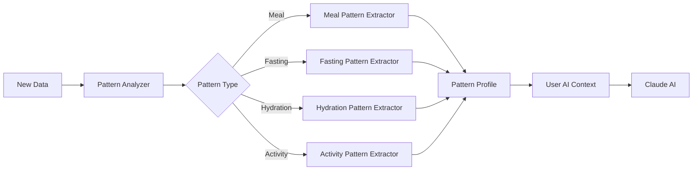

### Context Loading for AI Interactions

When a user interacts with Amigo, the system loads context in priority order:

1. **User Message**: The current user input
2. **Recent Conversation**: Last 10-20 message exchanges
3. **Today's Data**: All logs from current day
4. **Pattern Profile**: Identified behavioral patterns
5. **Preferences**: Learned user preferences
6. **Recent History**: Last 7 days of key data
7. **Goals & Progress**: Current goals and progress metrics
8. **Context Summary**: Compressed historical context

This prioritized loading ensures the most relevant information fits within Claude's context window while maintaining personalization depth.

### Coaching Adaptation Mechanism

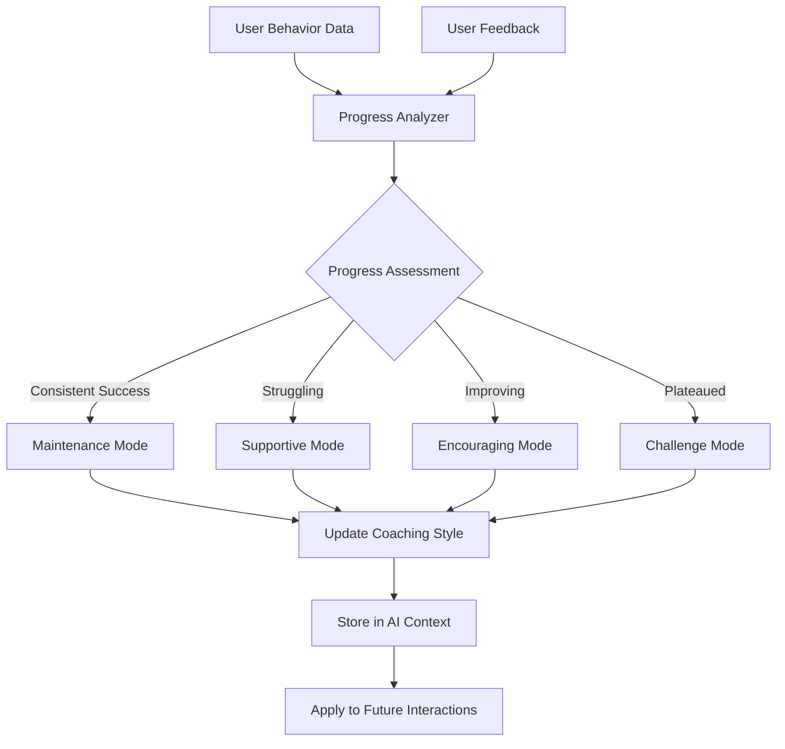


### Context Summarization Strategy

As user history grows, older detailed data is summarized to manage storage and context window constraints:

**Summarization Triggers:**
- Conversation history exceeds 100 messages
- Pattern profile data exceeds 90 days of detailed records
- Total context size approaches storage limits

**Summarization Process:**
1. Identify data older than retention threshold (e.g., 90 days)
2. Use Claude AI to generate summaries preserving key insights
3. Replace detailed records with summaries
4. Maintain detailed data for recent period (last 30 days)
5. Store summaries in context_summary field

**Preserved Information:**
- Key behavioral patterns
- Significant milestones
- Effective coaching approaches
- Important preferences
- Long-term trends

### Multi-Device Synchronization

User AI context is stored in Supabase Database and synchronized across devices:

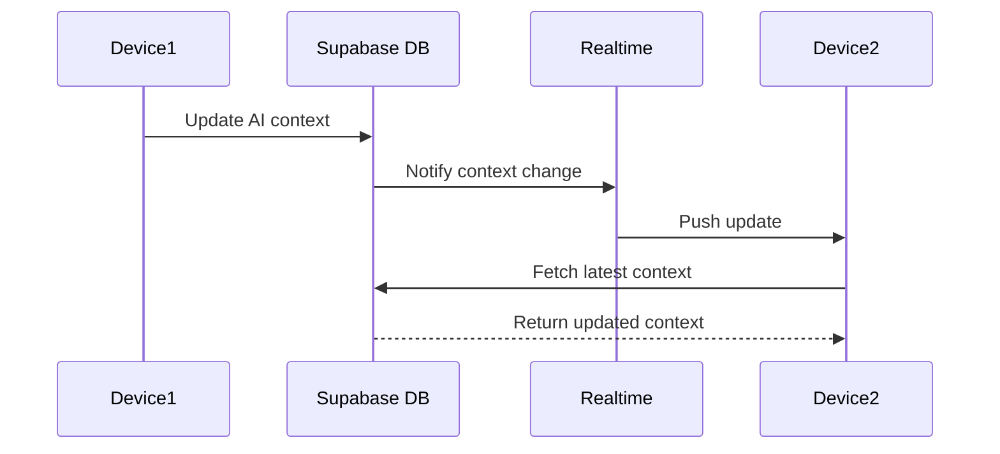

This ensures Amigo maintains consistent knowledge regardless of which device the user is using.

## Goal-Based Personalization Architecture

### Overview

The goal-based personalization system extends Amigo's AI capabilities to focus coaching on the user's current health objective while maintaining historical context from previous goals. This architecture enables users to switch between different health goals (weight loss, muscle gain, maintenance, improved energy, better sleep) while preserving goal-specific learning.

### Goal Management Flow

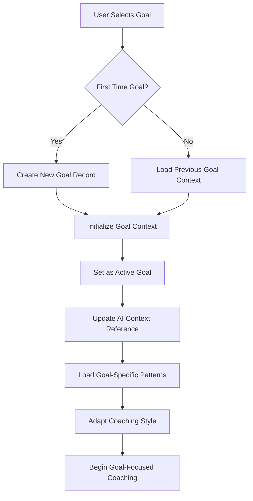

### Goal Transition Flow

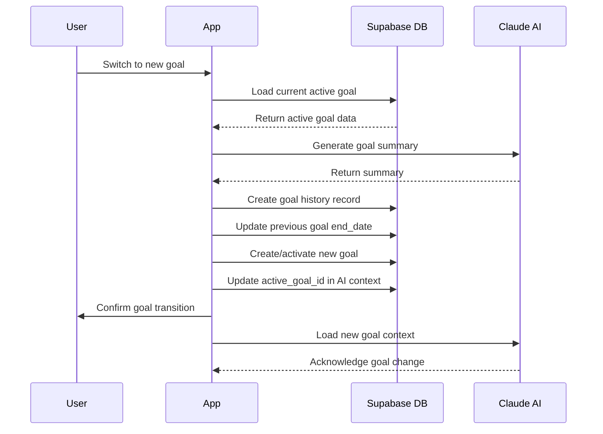

### Goal Context Storage Strategy

Each health goal maintains its own context data structure that includes:

**Goal-Specific Patterns:**
- Meal patterns that correlate with goal progress
- Fasting protocols that work well for this goal
- Hydration patterns optimized for this goal
- Activity patterns associated with goal success

**Goal-Specific Progress:**
- Metrics relevant to the goal type
- Milestones achieved during this goal
- Trends identified during goal pursuit

**Goal-Specific Coaching:**
- Effective coaching strategies for this goal
- Challenging areas identified during this goal
- Preferred approaches that resonate with user for this goal

### Active Goal Prioritization

When loading Session Context for AI interactions, the system prioritizes the active goal:

```typescript
function loadSessionContext(userId: string): SessionContext {
  // Load base context
  const baseContext = loadBaseContext(userId)
  
  // Load active goal
  const activeGoal = loadActiveGoal(userId)
  
  if (activeGoal) {
    // Prioritize active goal context
    const goalContext = activeGoal.goalContext
    
    // Merge goal-specific patterns with general patterns
    const mergedPatterns = {
      ...baseContext.patternProfile,
      mealPatterns: {
        ...baseContext.patternProfile.mealPatterns,
        // Overlay goal-specific patterns
        ...goalContext.patterns.mealPatterns
      },
      fastingPatterns: {
        ...baseContext.patternProfile.fastingPatterns,
        ...goalContext.patterns.fastingPatterns
      },
      hydrationPatterns: {
        ...baseContext.patternProfile.hydrationPatterns,
        ...goalContext.patterns.hydrationPatterns
      }
    }
    
    // Load relevant goal history for context
    const relevantHistory = loadRelevantGoalHistory(userId, activeGoal.goalType)
    
    return {
      ...baseContext,
      patternProfile: mergedPatterns,
      activeGoal: activeGoal,
      goalHistory: relevantHistory,
      progressSummary: generateGoalProgressSummary(activeGoal)
    }
  }
  
  return baseContext
}
```

### Pattern Analysis with Goal Context

The Pattern Analyzer operates in two modes:

**1. Goal-Specific Analysis:**
- Analyzes patterns within the context of the active goal
- Identifies correlations between behaviors and goal progress
- Stores patterns in the active goal's context
- Compares to patterns from previous instances of the same goal

**2. Cross-Goal Analysis:**
- Identifies patterns that remain consistent across different goals
- Recognizes behaviors that support multiple goal types
- Identifies optimal goal sequencing based on user history
- Stores cross-goal insights in the general pattern profile

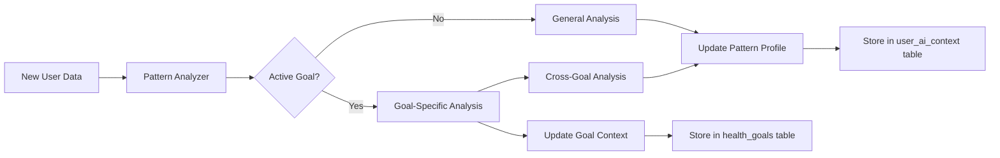

### Goal-Based Coaching Adaptation

The Coaching Adaptation Engine adjusts Amigo's approach based on the active goal:

**Weight Loss Goal:**
- Emphasis: Sustainable caloric deficit, consistency, habit formation
- Meal recommendations: Nutrient-dense, lower-calorie options
- Fasting suggestions: Protocols that support caloric deficit
- Coaching tone: Encouraging, focused on long-term sustainability

**Muscle Gain Goal:**
- Emphasis: Protein intake, progressive challenge, recovery
- Meal recommendations: Higher protein, adequate calories
- Fasting suggestions: Protocols that preserve muscle mass
- Coaching tone: Motivating, focused on strength and growth

**Maintenance Goal:**
- Emphasis: Balance, consistency, long-term habits
- Meal recommendations: Balanced macros, stable calories
- Fasting suggestions: Flexible protocols for lifestyle fit
- Coaching tone: Supportive, focused on sustainability

**Improved Energy Goal:**
- Emphasis: Energy patterns, meal timing, metabolic optimization
- Meal recommendations: Foods that support sustained energy
- Fasting suggestions: Protocols that enhance metabolic flexibility
- Coaching tone: Analytical, focused on optimization

**Better Sleep Goal:**
- Emphasis: Sleep hygiene, meal timing, evening routines
- Meal recommendations: Foods and timing that support sleep
- Fasting suggestions: Protocols that don't interfere with sleep
- Coaching tone: Calming, focused on rest and recovery

### Goal History Utilization

When a user returns to a previously pursued goal, the system:

1. Loads the previous goal context from goal_history
2. Retrieves goal-specific patterns that worked before
3. References successful strategies from the previous attempt
4. Compares current progress to previous progress
5. Suggests starting strategies based on past success
6. Helps user avoid patterns that didn't work before

```typescript
function loadHistoricalGoalContext(userId: string, goalType: string): GoalContext | null {
  const previousGoals = queryGoalHistory(userId, goalType)
  
  if (previousGoals.length === 0) {
    return null
  }
  
  // Find most recent successful instance
  const mostSuccessful = previousGoals.reduce((best, current) => {
    return current.outcomes.progressMetrics.success > best.outcomes.progressMetrics.success 
      ? current 
      : best
  })
  
  // Load the goal context from that instance
  const historicalGoal = loadGoal(mostSuccessful.goalId)
  
  return historicalGoal.goalContext
}
```

### Goal Progress Tracking

Each goal type has specific metrics tracked:

**Weight Loss:**
- Weight trend
- Caloric deficit consistency
- Meal logging consistency
- Fasting completion rate

**Muscle Gain:**
- Protein intake average
- Caloric surplus consistency
- Strength indicators (if available from health platforms)
- Meal frequency

**Maintenance:**
- Weight stability
- Habit consistency score
- Meal logging frequency
- Overall balance metrics

**Improved Energy:**
- User-reported energy levels
- Meal timing consistency
- Sleep quality (from health platforms)
- Activity patterns

**Better Sleep:**
- Sleep duration (from health platforms)
- Sleep quality scores
- Evening meal timing
- Hydration timing

### Database Schema for Goal-Based Personalization

The goal-based system uses three main tables:

**health_goals table:**
- Stores each goal instance with start/end dates
- Contains goal_context JSONB field with goal-specific data
- Links to user_ai_context via active_goal_id

**goal_history table:**
- Archives completed or paused goals
- Stores AI-generated summaries of goal outcomes
- Captures transition reasons for analysis

**user_ai_context table:**
- Updated to include active_goal_id reference
- Pattern profile includes goal-specific pattern maps
- Cross-goal patterns stored in general pattern profile

### Goal Context Synchronization

Goal context is synchronized across devices via Supabase Realtime:

```typescript
// Subscribe to goal changes
const goalChannel = supabase
  .channel(`user:${userId}:goals`)
  .on('postgres_changes',
    {
      event: '*',
      schema: 'public',
      table: 'health_goals',
      filter: `user_id=eq.${userId}`
    },
    (payload) => {
      if (payload.new.is_active) {
        // Active goal changed, reload context
        reloadSessionContext()
        updateDashboardGoalDisplay()
      }
    }
  )
  .subscribe()
```

This architecture ensures that goal-based personalization enhances Amigo's coaching while maintaining the cumulative learning that makes the AI increasingly effective over time.

## API Integration Patterns

### USDA FoodData Central Integration

**Authentication:**
- API key stored securely in environment variables
- Key included in request headers

**Caching Strategy:**
- Cache frequently accessed food items locally
- Cache duration: 30 days
- Reduce API calls for common foods

**Rate Limiting:**
- Respect USDA API rate limits
- Implement exponential backoff on rate limit errors
- Queue requests during high usage

**Fallback Strategy:**
- Use cached data when API unavailable
- Fall back to AI estimates if no cached data
- Display data source indicator to user

### Barcode API Integration

**API Selection:**
- Primary: Open Food Facts API (free, comprehensive)
- Secondary: UPC Database API (fallback)

**Workflow:**
1. Decode barcode from camera
2. Query primary barcode API
3. If not found, query secondary API
4. If still not found, offer USDA search
5. Cache successful lookups

**Caching:**
- Cache all successful barcode lookups
- Cache duration: 90 days (product data rarely changes)
- Significantly reduces API calls for frequently scanned items

### Health Platform Integration

#### OAuth Flow Pattern

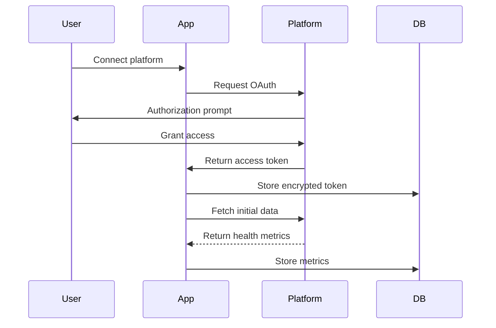

#### Sync Strategy

**Sync Frequency:**
- Automatic sync: Once per day (background)
- Manual sync: On-demand via user action
- Real-time sync: Not supported by most platforms

**Sync Window:**
- Fetch data from last 7 days on each sync
- Prevents duplicate data via unique constraints
- Handles gaps from missed syncs

**Error Handling:**
- Retry failed syncs up to 3 times with exponential backoff
- Log sync errors for monitoring
- Display last successful sync time to user
- Allow manual retry

#### Platform-Specific Considerations

**Fitbit:**
- OAuth 2.0 with refresh tokens
- Rate limit: 150 requests per hour per user
- Metrics: steps, heart rate, sleep, exercise

**Garmin:**
- OAuth 1.0a
- Requires developer account and app registration
- Metrics: steps, heart rate, sleep, activities

**Apple Health (iOS):**
- Uses HealthKit framework (no OAuth)
- Requires user permission per data type
- Real-time access to health data
- Metrics: steps, heart rate, sleep, workouts

**Google Health Connect (Android):**
- Uses Health Connect API
- Requires user permission per data type
- Aggregates data from multiple sources
- Metrics: steps, heart rate, sleep, exercise

### Payment Gateway Integration

**Gateway Selection:**
- iOS: Apple In-App Purchase (required)
- Android: Google Play Billing (required)
- Web: Stripe (if web version exists)

**Subscription Flow:**
1. User selects subscription tier
2. App displays pricing and features
3. User confirms purchase
4. Gateway processes payment
5. App receives purchase confirmation
6. Update subscription in Supabase
7. Grant tier-specific features immediately
8. Store transaction record

**Receipt Validation:**
- Validate receipts with platform APIs
- Store validated receipts in database
- Enable purchase restoration across devices

**Subscription Management:**
- Handle renewals automatically via platform
- Listen for subscription status changes
- Update database on cancellation/expiration
- Maintain access until end of billing period

## Real-Time Synchronization Architecture

### Supabase Realtime Channels

**Channel Structure:**
- One channel per user: `user:{userId}`
- Subscribe to changes on user-specific tables
- Filter by user_id using RLS policies

**Subscribed Tables:**
- meal_logs
- water_logs
- fasting_sessions
- health_metrics
- subscriptions
- user_ai_context

**Event Handling:**

```typescript
// Subscribe to user's data changes
const channel = supabase
  .channel(`user:${userId}`)
  .on('postgres_changes', 
    { 
      event: '*', 
      schema: 'public', 
      table: 'meal_logs',
      filter: `user_id=eq.${userId}`
    }, 
    (payload) => {
      handleMealLogChange(payload)
    }
  )
  .on('postgres_changes',
    {
      event: '*',
      schema: 'public',
      table: 'subscriptions',
      filter: `user_id=eq.${userId}`
    },
    (payload) => {
      handleSubscriptionChange(payload)
    }
  )
  .subscribe()
```

**Conflict Resolution:**
- Last-write-wins strategy
- Timestamp-based conflict detection
- Display sync conflicts to user when detected
- Allow user to choose which version to keep

**Offline Handling:**
- Queue changes locally when offline
- Sync queued changes when connection restored
- Merge remote changes with local queue
- Resolve conflicts before syncing

## Error Handling

### Error Categories

#### 1. Network Errors
- **Detection**: Timeout, connection refused, DNS failure
- **Handling**: 
  - Display offline indicator
  - Queue operations for later sync
  - Use cached data when available
  - Retry with exponential backoff

#### 2. Authentication Errors
- **Detection**: Invalid token, expired session, unauthorized
- **Handling**:
  - Attempt token refresh
  - If refresh fails, prompt re-authentication
  - Preserve user's current work
  - Redirect to login after save

#### 3. API Errors
- **Detection**: Rate limit, service unavailable, invalid response
- **Handling**:
  - USDA API: Use cached data or AI estimates
  - Barcode API: Try fallback API, then manual search
  - Health Platform: Display last sync time, allow manual retry
  - Bedrock: Display service unavailable, allow manual entry

#### 4. Validation Errors
- **Detection**: Invalid input, constraint violation, business rule violation
- **Handling**:
  - Display clear error message
  - Highlight problematic fields
  - Provide correction guidance
  - Preserve valid input

#### 5. Storage Errors
- **Detection**: Disk full, permission denied, quota exceeded
- **Handling**:
  - Notify user of storage issue
  - Suggest clearing cache or old data
  - Prevent new uploads until resolved
  - Maintain critical data in memory

### Error Logging Strategy

**Client-Side Logging:**
- Log level: Error, Warning, Info, Debug
- Include: timestamp, user_id, error type, stack trace, context
- Exclude: sensitive data (passwords, tokens, health details)
- Send to monitoring service (e.g., Sentry)

**Server-Side Logging:**
- Log all API errors
- Log authentication failures
- Log database errors
- Log external API failures
- Monitor error rates and alert on spikes

### User-Facing Error Messages

**Principles:**
- Use plain language, avoid technical jargon
- Explain what happened
- Provide actionable next steps
- Offer support contact for unresolvable issues

**Examples:**

```typescript
const errorMessages = {
  network: {
    title: "Connection Issue",
    message: "We couldn't connect to the server. Your data has been saved locally and will sync when you're back online.",
    action: "Retry"
  },
  usda_api: {
    title: "Nutrition Data Unavailable",
    message: "We couldn't fetch verified nutrition data right now. We've used our AI estimate instead.",
    action: "OK"
  },
  quota_exceeded: {
    title: "Meal Log Limit Reached",
    message: "You've used all your meal logs for this period. Upgrade to Pro for unlimited logs.",
    action: "View Plans"
  },
  ai_unavailable: {
    title: "AI Service Unavailable",
    message: "Amigo is temporarily unavailable. You can still log meals manually.",
    action: "Log Manually"
  }
}
```


## Correctness Properties

A property is a characteristic or behavior that should hold true across all valid executions of a system—essentially, a formal statement about what the system should do. Properties serve as the bridge between human-readable specifications and machine-verifiable correctness guarantees.

### Property Reflection

After analyzing all acceptance criteria, I identified several areas where properties could be consolidated:

- **Session token generation** (1.5 and 2.3): Both describe token generation on successful auth - combined into one property
- **Data persistence** (20.1 and 20.2): Combined into a single round-trip property
- **RLS policies** (107.3, 107.4, etc.): All RLS policies follow the same pattern - combined into one comprehensive property
- **AI context storage** (116.4 and 116.5): Both about storing conversation messages - combined into one property
- **Nutritional calculation** (21.1 and 21.2): Both about calculating nutrition data - combined into one property

### Property 1: Email Format Validation

For any string input, the email validator should correctly identify whether it matches valid email format according to RFC 5322 standards.

**Validates: Requirements 1.1**

### Property 2: Email Uniqueness Enforcement

For any email address, attempting to create a second account with the same email should fail with an appropriate error, regardless of when the first account was created.

**Validates: Requirements 1.2**

### Property 3: Account Creation Completeness

For any valid, available email and password combination, account creation should result in a User_Account record with all required fields populated (email, password hash, creation timestamp).

**Validates: Requirements 1.3**

### Property 4: Password Hashing Security

For any password, the stored Password_Hash should never match the plain text password, and the same password should produce different hashes when accounts are created at different times (due to salt).

**Validates: Requirements 1.4**

### Property 5: Session Token Generation on Authentication

For any successful authentication (account creation or sign-in), the system should generate a valid Session_Token that can be used for subsequent authenticated requests.

**Validates: Requirements 1.5, 2.3**

### Property 6: Account Retrieval by Email

For any registered email address, the authentication system should be able to retrieve the associated User_Account.

**Validates: Requirements 2.1**

### Property 7: Password Verification Correctness

For any User_Account, providing the correct password should result in successful authentication, and providing an incorrect password should result in authentication failure.

**Validates: Requirements 2.2**

### Property 8: Session Token Secure Storage

For any Session_Token, when stored on the device, it should be encrypted and not accessible in plain text.

**Validates: Requirements 7.1**

### Property 9: Session Token Validation

For any Session_Token, validation should succeed if the token is valid and not expired, and should fail if the token is invalid, expired, or revoked.

**Validates: Requirements 7.2**

### Property 10: Image-Based Meal Log Creation

For any food photo, the Image_Logger should process the image and create a Meal_Log with identified food items and estimated nutritional information.

**Validates: Requirements 10.1, 10.2**

### Property 11: Nutritional Data Completeness

For any Meal_Log created through any input method, the nutritional data should include at minimum: calories, protein, carbohydrates, and fat values.

**Validates: Requirements 10.5, 21.1, 21.2**

### Property 12: Voice Input Transcription

For any voice input describing a meal, the Voice_Logger should transcribe the audio to text and parse food items and quantities from the transcription.

**Validates: Requirements 11.1, 11.2**

### Property 13: Text Meal Description Parsing

For any text description of a meal, the Text_Logger should parse and extract food items and quantities.

**Validates: Requirements 12.1**

### Property 14: Free Tier Quota Enforcement

For any Free tier user, the system should prevent creating more than the allowed number of meal logs per input method (3-5 image, 5-10 voice, 10-20 text).

**Validates: Requirements 13.1**

### Property 15: Usage Quota Tracking Accuracy

For any sequence of meal log creations, the tracked usage quota should exactly match the number of logs created for each input method.

**Validates: Requirements 17.1, 17.2**

### Property 16: Meal History Chronological Ordering

For any set of Meal_Logs belonging to a user, when retrieved, they should be ordered by timestamp in chronological order (oldest to newest or newest to oldest as specified).

**Validates: Requirements 19.1**

### Property 17: Data Persistence Round Trip

For any user data (Meal_Logs, Water_Logs, Fasting_Sessions, subscription information), after persisting to the Data_Store and restarting the application, the retrieved data should match the original data.

**Validates: Requirements 20.1, 20.2**

### Property 18: USDA Food Search

For any search query string, the system should query the USDA_API and return matching food items from the Food_Database.

**Validates: Requirements 33.1**

### Property 19: Barcode Decoding

For any valid UPC or EAN barcode image, the Barcode_Scanner should successfully decode the Product_Identifier.

**Validates: Requirements 34.2**

### Property 20: Serving Quantity Scaling

For any Nutritional_Data and serving quantity multiplier, the calculated total nutritional values should be the base values multiplied by the quantity.

**Validates: Requirements 36.3**

### Property 21: Data Source Prioritization

For any meal log where both USDA_API data and AI estimates are available, the system should use the USDA_API data as the primary source.

**Validates: Requirements 37.6**

### Property 22: Water Log Creation and Progress Update

For any water intake volume, creating a Water_Log should result in both a persisted log record and an updated daily Hydration_Progress value.

**Validates: Requirements 44.1, 44.6**

### Property 23: Water Goal Validation

For any water goal value, the system should accept positive values and reject zero or negative values.

**Validates: Requirements 45.2**

### Property 24: Fasting Session Duration Calculation

For any Fasting_Session with start and end timestamps, the calculated Fasting_Duration should equal the time difference between end and start.

**Validates: Requirements 49.1, 49.4**

### Property 25: Fasting Streak Increment

For any completed Fasting_Session that meets the protocol goal, the user's Fasting_Streak should increment by one.

**Validates: Requirements 52.5**

### Property 26: Fasting Streak Reset

For any user with an active Fasting_Streak, if a day passes without completing a fasting goal, the streak should reset to zero.

**Validates: Requirements 52.6**

### Property 27: Data Export Format Validity

For any user data export in JSON format, the output should be valid, parseable JSON. For any export in CSV format, the output should be valid CSV with proper escaping.

**Validates: Requirements 82.3, 82.4**

### Property 28: Data Export Completeness

For any user account, a complete data export should include all Meal_Logs, Water_Logs, Fasting_Sessions, user profile information, and health goals.

**Validates: Requirements 82.10**

### Property 29: Account Deletion Cascade

For any user account deletion, all associated data (Meal_Logs, Water_Logs, Fasting_Sessions, Health_Metrics, AI_Context, Conversation_History) should be deleted from the system.

**Validates: Requirements 84.4, 84.5**

### Property 30: Unit Conversion Accuracy

For any existing data set and unit preference change, all displayed values should be correctly converted to the new units using standard conversion factors.

**Validates: Requirements 87.5**

### Property 31: Offline Data Queueing and Sync

For any data operation performed while offline, the operation should be queued locally, and when connectivity is restored, the queued operations should automatically sync to the server.

**Validates: Requirements 96.5, 96.6**

### Property 32: Row-Level Security Isolation

For any user and any data table (Meal_Logs, Water_Logs, Fasting_Sessions, Health_Metrics, AI_Context), the user should only be able to access their own records and should not be able to access records belonging to other users.

**Validates: Requirements 107.3, 107.4, and all other RLS requirements**

### Property 33: AI Identification Correction

For any AI-generated food identification, the user should be able to correct the identification, and the correction should be persisted in the Meal_Log.

**Validates: Requirements 110.8**

### Property 34: AI Context Persistence

For any AI interaction (message sent to Amigo or Amigo response), the User_AI_Context should be updated and persisted to Supabase_Database.

**Validates: Requirements 115.4**

### Property 35: Conversation History Storage

For any message exchange between user and Amigo (both user messages and Amigo responses), the messages should be stored in Conversation_History with timestamps.

**Validates: Requirements 116.4, 116.5**

### Property 36: Pattern Profile Updates

For any new meal data logged, the Pattern_Analyzer should update the User_Pattern_Profile to reflect the new data in identified patterns.

**Validates: Requirements 117.7**

### Property 37: Session Context Provision

For any message sent to Amigo, the AI_Conversation_Engine should provide Session_Context (including conversation history, pattern profile, recent data) to Claude_AI.

**Validates: Requirements 121.7**

### Property 38: Cross-Device AI Context Sync

For any AI interaction on one device, the updated User_AI_Context should be synchronized to Supabase_Database and be accessible from other devices.

**Validates: Requirements 130.2**

### Property 39: AI Context Summarization

For any User_AI_Context that exceeds size thresholds, the Pattern_Analyzer should generate summaries and replace detailed historical data with summaries while preserving key insights.

**Validates: Requirements 136.1, 136.4**

### Property 40: Feedback Rating Storage

For any Amigo response, the user should be able to provide a feedback rating (helpful/not helpful), and the rating should be stored with the conversation record.

**Validates: Requirements 137.1**

### Property 41: Health Goal Creation and Activation

For any valid health goal type, creating a new goal should result in a health_goals record with is_active set to true and the user_ai_context.active_goal_id updated to reference the new goal.

**Validates: Requirements 138.3, 138.4**

### Property 42: Goal Transition History Creation

For any goal transition (switching from one goal to another), the system should create a goal_history record for the previous goal with a summary and update the previous goal's end_date.

**Validates: Requirements 139.2, 139.3**

### Property 43: Goal Context Preservation

For any health goal that is deactivated (when user switches to a different goal), the goal_context data should be preserved in the health_goals table and remain accessible for future reference.

**Validates: Requirements 140.5**

### Property 44: Active Goal Context Loading

For any user with an active goal, when loading Session_Context, the system should include the active goal's goal_context and prioritize goal-specific patterns over general patterns.

**Validates: Requirements 141.1, 141.2**

### Property 45: Goal-Specific Pattern Storage

For any new meal, water, or fasting data logged while a goal is active, the Pattern_Analyzer should update both the general pattern profile and the goal-specific patterns in the active goal's goal_context.

**Validates: Requirements 142.1, 142.5**

### Property 46: Goal-Based Recommendation Alignment

For any meal recommendation generated by the AI_Coach, the recommendation should align with the active goal's parameters (e.g., caloric deficit for weight loss, higher protein for muscle gain).

**Validates: Requirements 143.2, 143.3, 143.4**

### Property 47: Goal-Based Fasting Protocol Suggestions

For any fasting protocol suggestion, the AI_Coach should recommend protocols appropriate for the active goal type.

**Validates: Requirements 144.2, 144.3**

### Property 48: Goal-Based Water Target Adjustment

For any active goal, the system should adjust water intake recommendations based on the goal type's hydration requirements.

**Validates: Requirements 145.2, 145.3**

### Property 49: Goal-Focused Insight Generation

For any insight generated by the AI_Insight_Generator while a goal is active, the insight should focus on metrics and behaviors relevant to the active goal.

**Validates: Requirements 146.1, 146.2**

### Property 50: Goal Transition Acknowledgment

For any goal transition, the AI_Conversation_Engine should acknowledge the transition in the next coaching interaction and reference the transition reason if provided.

**Validates: Requirements 147.5, 147.6**

### Property 51: Cross-Goal Pattern Recognition

For any user with multiple completed goals, the Pattern_Analyzer should identify patterns that remain consistent across different goal types and store them in the general pattern profile.

**Validates: Requirements 148.1, 148.2**

### Property 52: Goal-Specific Coaching Style Application

For any active goal, the Coaching_Adaptation_Engine should apply coaching style parameters appropriate for that goal type (e.g., supportive for weight loss, motivating for muscle gain).

**Validates: Requirements 149.2, 149.3**

### Property 53: Goal Progress Metrics Tracking

For any active goal, the system should track progress metrics specific to that goal type and display them on the Dashboard.

**Validates: Requirements 150.1, 150.7**

### Property 54: Historical Goal Context Retrieval

For any goal type that a user has pursued before, when setting that goal as active again, the system should load the previous goal_context from the most recent instance of that goal type.

**Validates: Requirements 151.1, 151.2**

## Testing Strategy

### Dual Testing Approach

Amigo requires both unit testing and property-based testing to ensure comprehensive correctness:

**Unit Tests** focus on:
- Specific examples of meal logging workflows
- Edge cases (empty inputs, boundary values, special characters)
- Error conditions (network failures, invalid tokens, API errors)
- Integration points between components
- UI interactions and state management
- Platform-specific behavior (iOS vs Android)

**Property-Based Tests** focus on:
- Universal properties that hold for all inputs
- Data integrity across operations
- Security properties (RLS, encryption, authentication)
- Consistency across devices and sessions
- Correctness of calculations and transformations

Both approaches are complementary and necessary. Unit tests catch specific bugs and validate concrete scenarios, while property tests verify that the system behaves correctly across the entire input space.

### Property-Based Testing Configuration

**Framework Selection:**
- iOS: SwiftCheck or swift-check
- Android: Kotest Property Testing or junit-quickcheck
- Backend/API: fast-check (TypeScript) or Hypothesis (Python)

**Test Configuration:**
- Minimum 100 iterations per property test (due to randomization)
- Configurable seed for reproducibility
- Shrinking enabled to find minimal failing cases
- Timeout: 30 seconds per property test

**Test Tagging:**
Each property-based test must include a comment tag referencing the design document property:

```swift
// Feature: health-app, Property 1: Email Format Validation
func testEmailFormatValidation() {
  property("Email validator correctly identifies valid and invalid emails") <- forAll { (input: String) in
    let isValid = EmailValidator.validate(input)
    let matchesRFC5322 = RFC5322Regex.matches(input)
    return isValid == matchesRFC5322
  }
}
```

```kotlin
// Feature: health-app, Property 15: Usage Quota Tracking Accuracy
@Test
fun testUsageQuotaTrackingAccuracy() = runTest {
  checkAll(Arb.list(Arb.mealLog(), 1..100)) { mealLogs ->
    val tracker = UsageQuotaTracker()
    mealLogs.forEach { tracker.recordMealLog(it) }
    
    val imageCount = mealLogs.count { it.inputMethod == InputMethod.IMAGE }
    val voiceCount = mealLogs.count { it.inputMethod == InputMethod.VOICE }
    val textCount = mealLogs.count { it.inputMethod == InputMethod.TEXT }
    
    tracker.imageQuotaUsed shouldBe imageCount
    tracker.voiceQuotaUsed shouldBe voiceCount
    tracker.textQuotaUsed shouldBe textCount
  }
}
```

### Unit Testing Strategy

**Coverage Goals:**
- Minimum 80% code coverage
- 100% coverage for authentication and security code
- 100% coverage for payment and subscription logic
- 90% coverage for data persistence layer

**Test Organization:**
- Group tests by feature module
- Separate integration tests from unit tests
- Use test doubles (mocks, stubs) for external dependencies
- Test both success and failure paths

**Key Unit Test Areas:**

1. **Authentication Module**
   - Email format validation edge cases
   - Password strength requirements
   - OAuth flow error handling
   - Session token expiration
   - Token refresh logic

2. **Meal Logging Module**
   - Image upload failures
   - AI service unavailability
   - USDA API rate limiting
   - Barcode scanning edge cases
   - Quota enforcement at boundaries

3. **Water Tracking Module**
   - Midnight reset timing
   - Goal achievement detection
   - Reminder scheduling
   - Unit conversion edge cases

4. **Fasting Module**
   - Timer accuracy
   - Streak calculation edge cases
   - Protocol validation
   - Notification timing

5. **AI Coaching Module**
   - Context loading performance
   - Conversation history limits
   - Pattern analysis accuracy
   - Summarization quality

6. **Subscription Module**
   - Trial period expiration
   - Payment failure handling
   - Receipt validation
   - Purchase restoration

7. **Data Sync Module**
   - Conflict resolution
   - Offline queue management
   - Realtime event handling
   - Cross-device consistency

### Integration Testing

**Test Scenarios:**
- End-to-end meal logging flow (image → AI analysis → USDA enrichment → storage)
- Complete authentication flow (sign up → verify → sign in → session management)
- Health platform sync flow (OAuth → fetch data → store → display)
- Subscription purchase flow (select tier → payment → activation → feature access)
- Cross-device sync (log on device 1 → verify on device 2)

**Test Environment:**
- Staging Supabase instance
- Mock Amazon Bedrock responses (to control costs)
- Mock payment gateway (test mode)
- Mock health platform APIs

### Performance Testing

**Key Metrics:**
- App launch time: < 2 seconds
- Meal log creation: < 3 seconds (including AI analysis)
- Dashboard load: < 2 seconds
- Image upload: < 5 seconds for 5MB photo
- Amigo response time: < 3 seconds
- Database query time: < 500ms for typical queries

**Load Testing:**
- Simulate 1000 concurrent users
- Test database performance under load
- Test Realtime channel scalability
- Test AI service rate limiting

### Security Testing

**Test Areas:**
- SQL injection attempts
- XSS attack vectors
- Authentication bypass attempts
- RLS policy enforcement
- Token theft and replay attacks
- Data encryption verification
- GDPR compliance validation

### Accessibility Testing

**Requirements:**
- Screen reader compatibility
- Keyboard navigation
- Color contrast ratios (WCAG AA)
- Text scaling support
- Voice control support

### Monitoring and Observability

**Metrics to Track:**
- Error rates by feature
- API response times
- AI service costs
- Database query performance
- User engagement metrics
- Subscription conversion rates
- Crash rates

**Alerting:**
- Error rate > 5%
- API response time > 5 seconds
- Database query time > 2 seconds
- AI service costs exceed budget
- Payment processing failures
- Data sync failures

This comprehensive testing strategy ensures Amigo maintains high quality, security, and performance while delivering a reliable AI-powered health coaching experience.
