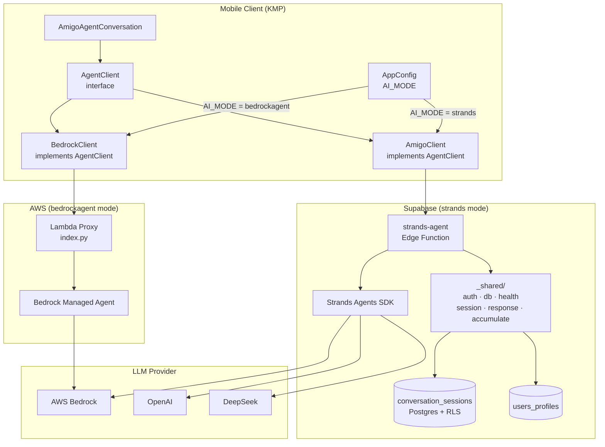
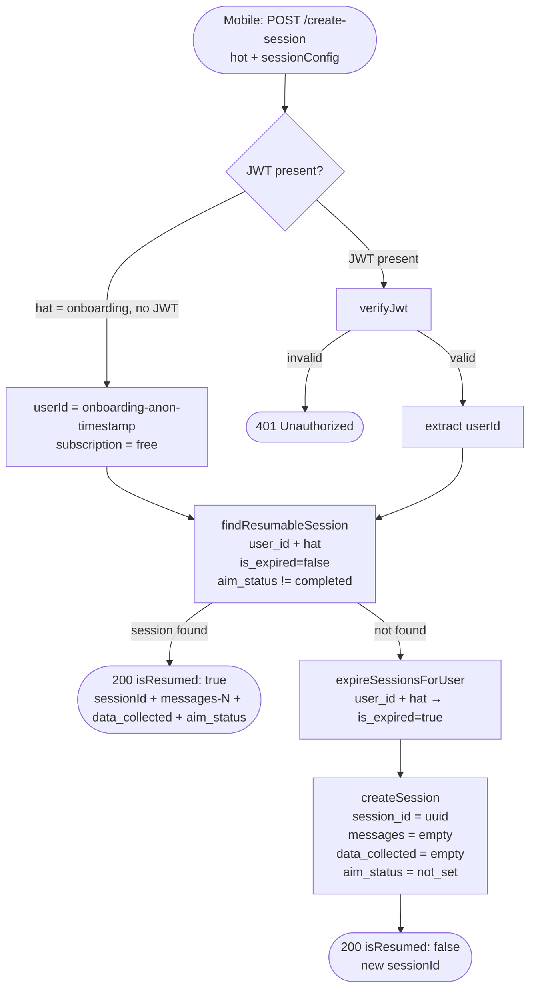
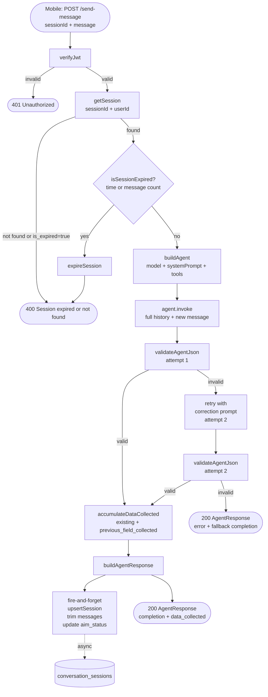
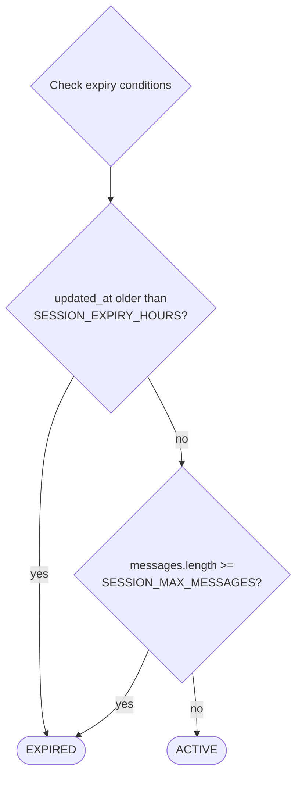
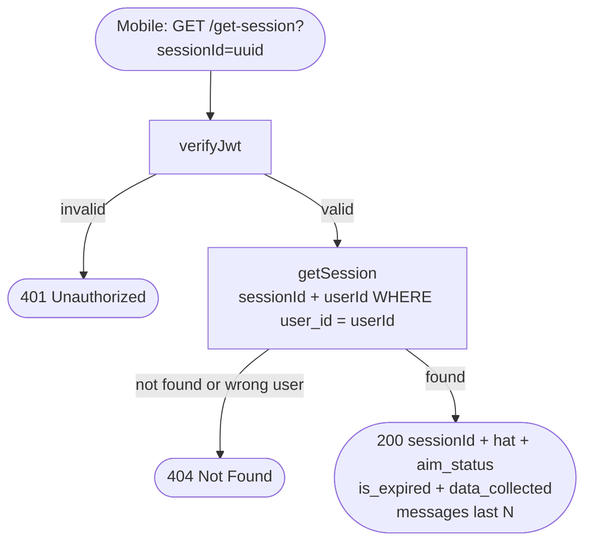
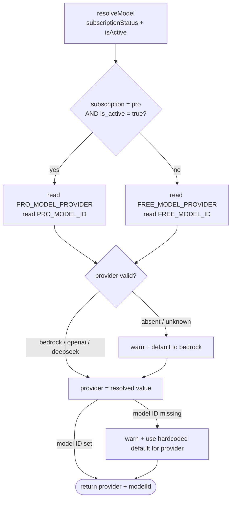
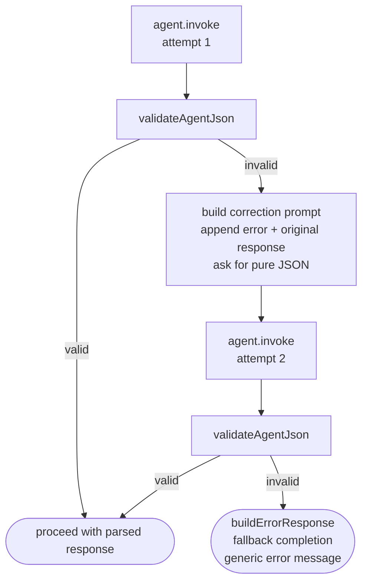
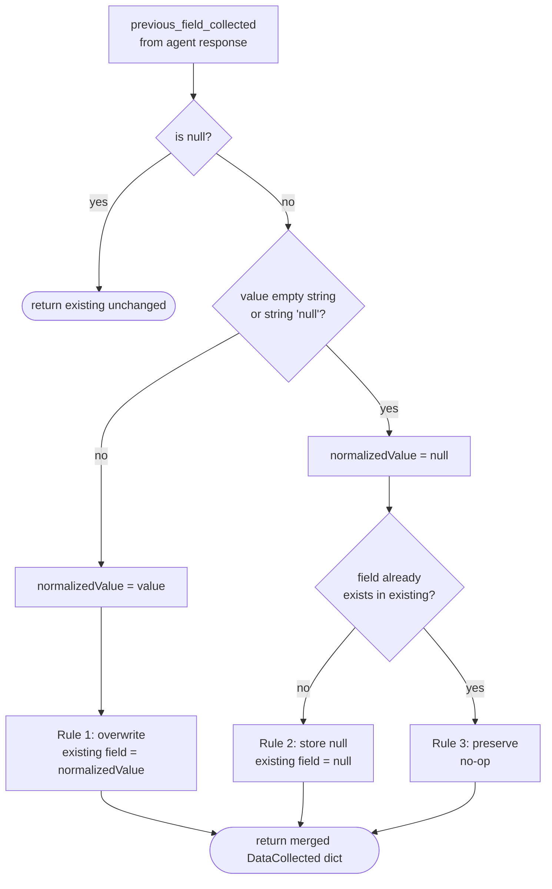

# Design Document: strands-migration

## Overview

This migration replaces the AWS Lambda (Python) + Bedrock Managed Agents backend with the Strands Agents TypeScript SDK running inside a Supabase Edge Function. The new backend exposes a three-endpoint session API (`POST /create-session`, `GET /get-session`, `POST /send-message`) that returns the identical `Agent_Response` JSON shape the mobile client already consumes. All business logic lives in `supabase/functions/_shared/` as plain TypeScript so any future edge function can import it directly without touching the Strands SDK.

The migration is zero-downtime: `AppConfig.AI_MODE` switches the mobile client between the existing Lambda path (`"bedrockagent"`) and the new edge function path (`"strands"`). Both paths return the same response contract.

### System Architecture




---

## 1. Directory Structure

```
supabase/
├── functions/
│   ├── _shared/
│   │   ├── types.ts               # Shared TypeScript interfaces
│   │   ├── auth.ts                # JWT verification
│   │   ├── db.ts                  # All database operations
│   │   ├── health.ts              # Pure health calculation functions
│   │   ├── session.ts             # Session lifecycle helpers
│   │   ├── response.ts            # Agent response builders + JSON validation
│   │   └── accumulate.ts          # data_collected accumulation logic
│   ├── strands-agent/
│   │   ├── index.ts               # Router + all three endpoint handlers
│   │   ├── model.ts               # Model provider resolution
│   │   └── tools.ts               # Strands tool registrations (thin wrappers)
│   └── tests/
│       ├── helpers/
│       │   ├── auth.ts            # Sign-in helper, returns JWT
│       │   └── cleanup.ts         # Delete test sessions/profiles after each test
│       ├── health-calculations.property.test.ts
│       ├── accumulate.property.test.ts
│       ├── response.property.test.ts
│       ├── session.property.test.ts
│       ├── create-session.test.ts
│       ├── get-session.test.ts
│       ├── send-message.test.ts
│       └── health-calculations.test.ts
└── migrations/
    └── 20260315000001_create_conversation_sessions.sql
```


---

## 2. Mobile Client Design

### `AgentClient` Interface

A new interface in `mobile/shared/src/commonMain/kotlin/com/amigo/shared/ai/AgentClient.kt` that both clients implement. `AmigoAgentConversation` is refactored to depend on this interface.

```kotlin
interface AgentClient {
    /** True when the backend owns session state (strands mode). False for bedrockagent mode. */
    val ownsSessionState: Boolean

    suspend fun createSession(hat: String, sessionConfig: SessionConfigPayload): Result<CreateSessionResponse>
    suspend fun sendMessage(sessionId: String, message: String): Result<BedrockResponse>
    suspend fun getSession(sessionId: String): Result<GetSessionResponse>
    fun close()
}

data class CreateSessionResponse(
    val sessionId: String,
    val isResumed: Boolean,
    val messages: List<ConversationMessage>,
    val dataCollected: List<DataCollectedEntry>,
    val aimStatus: String
)

data class GetSessionResponse(
    val sessionId: String,
    val hat: String,
    val aimStatus: String,
    val isExpired: Boolean,
    val dataCollected: List<DataCollectedEntry>,
    val messages: List<ConversationMessage>
)

data class DataCollectedEntry(
    val field: String,
    val label: String,
    val value: String?
)
```

`BedrockClient` implements `AgentClient` with `ownsSessionState = false` — `createSession` returns a stub `CreateSessionResponse` (the Lambda owns session state internally), and `sendMessage` delegates to the existing `invokeAgent`.

`AmigoClient` implements `AgentClient` with `ownsSessionState = true`.

### `AmigoClient`

New file: `mobile/shared/src/commonMain/kotlin/com/amigo/shared/ai/AmigoClient.kt`

```kotlin
class AmigoClient(
    private val edgeFunctionUrl: String,   // AppConfig.STRANDS_EDGE_FUNCTION_URL
    private val getAuthToken: suspend () -> String?
) : AgentClient {

    // POST /create-session
    override suspend fun createSession(hat: String, sessionConfig: SessionConfigPayload): Result<CreateSessionResponse>

    // POST /send-message — body: { sessionId, message } only
    // Maps response to BedrockResponse for AmigoAgentConversation compatibility
    override suspend fun sendMessage(sessionId: String, message: String): Result<BedrockResponse>

    // GET /get-session?sessionId=<uuid>
    override suspend fun getSession(sessionId: String): Result<GetSessionResponse>
}
```

Key design points:
- No `agentId`, `agentAliasId`, `returnControlInvocationResults`, or `dataCollected` in any request
- `sendMessage` maps `AgentResponse.completion` → `BedrockResponse.completion` so `AmigoAgentConversation.handleAgentResponse` is unchanged
- `sendMessage` maps `AgentResponse.data_collected` (the `[{field, label, value}]` array) → `BedrockResponse.dataCollected` (as a `JsonElement`) so `AmigoAgentConversation` can read accumulated fields for display
- `invocations` is always `null` in the response → `processActionInvocations` is never called

### `AmigoAgentConversation` changes

- Constructor changes from `bedrockClient: BedrockClient` to `agentClient: AgentClient`
- On `startSession`: if `agentClient.ownsSessionState`, call `createSession` to get `sessionId` (resuming if available); store `sessionId` for subsequent `sendMessage` calls
- `invokeAgentForCompletion` calls `agentClient.sendMessage(sessionId, message)` instead of `bedrockClient.invokeAgent(...)`
- `processActionInvocations` is skipped when `agentClient.ownsSessionState` (invocations always null in strands mode)

### `AppConfig` wiring

```kotlin
object AppConfig {
    const val AI_MODE = "strands"   // or "bedrockagent"
    const val BEDROCK_API_ENDPOINT = "..."
    const val STRANDS_EDGE_FUNCTION_URL = "https://<project>.supabase.co/functions/v1/strands-agent"
}
```

`SessionInitializerFactory` (or wherever `AmigoAgentConversation` is constructed) reads `AI_MODE` and injects either `BedrockClient` or `AmigoClient`.

---

## 3. `_shared/` Module Breakdown

### `_shared/types.ts`

All shared TypeScript interfaces. No runtime logic.

```typescript
export interface AgentResponse {
  completion: AgentCompletion | null
  data_collected: DataCollectedEntry[] | null
  invocations: FunctionInvocation[] | null
  invocationId: string | null
  error: string | null
  userId: string | null
  subscription_status: string | null
  timestamp: string
}

export interface AgentCompletion {
  status_of_aim: 'not_set' | 'in_progress' | 'completed'
  ui: { render: { type: 'info' | 'message' | 'message_with_summary'; text: string }; tone?: string }
  // input is null when render.type === 'info' (auto-acknowledged by client, no input needed)
  input: { type: 'text' | 'weight' | 'date' | 'quick_pills' | 'yes_no' | 'dropdown'; options?: Array<{ label: string; value: string }> } | null
  previous_field_collected: { field: string; label: string; value: string | null } | null
}

// Stored internally as a flat dict; serialized to array for the API response
export type DataCollected = Record<string, string | null>

// Wire format returned to the mobile client — matches the Lambda's existing format
export interface DataCollectedEntry {
  field: string
  label: string
  value: string | null
}

export interface FunctionInvocation {
  action_group: string
  function_name: string
  params: Record<string, string>
}

export interface ConversationMessage {
  role: 'user' | 'assistant'
  content: string
}

export interface SessionConfig {
  hat: string
  responsibilities: string[]
  data_to_be_collected: string[]
  data_to_be_calculated: string[]
  notes: string[]
  initial_message?: string
}

export interface SessionRecord {
  session_id: string
  user_id: string
  hat: string
  messages: ConversationMessage[]
  data_collected: DataCollected
  aim_status: 'not_set' | 'in_progress' | 'completed'
  is_expired: boolean
  updated_at: string
}

export interface JwtPayload {
  userId: string
  subscriptionStatus: 'free' | 'pro'
  isActive: boolean
}
```


### `_shared/auth.ts`

JWT verification using Supabase's `auth.getUser()` pattern (same as existing edge functions).

```typescript
import { createClient } from "https://esm.sh/@supabase/supabase-js@2"
import type { JwtPayload } from "./types.ts"

// Returns null if JWT is absent, malformed, or expired.
export async function verifyJwt(jwt: string): Promise<JwtPayload | null>

// Extracts subscription info from the JWT's user_subscription custom claim.
// Falls back to { subscriptionStatus: 'free', isActive: true } if claim is absent.
function extractSubscription(user: SupabaseUser): Pick<JwtPayload, 'subscriptionStatus' | 'isActive'>
```

Implementation notes:
- Creates an anon Supabase client and calls `authClient.auth.getUser(jwt)`
- Reads `user_subscription.subscription_status` and `user_subscription.is_active` from `user.app_metadata` or custom claims
- Returns `null` on any error (expired, invalid signature, network failure)

### `_shared/db.ts`

All database operations. Accepts a Supabase client instance; no Strands SDK dependency.

```typescript
import type { SupabaseClient } from "https://esm.sh/@supabase/supabase-js@2"
import type { SessionRecord, DataCollected, ConversationMessage } from "./types.ts"

// Profile operations
export async function getProfile(client: SupabaseClient, userId: string): Promise<ProfileRow | null>
export async function saveOnboardingData(client: SupabaseClient, userId: string, fields: Partial<ProfileRow>): Promise<void>
export async function getOnboardingStatus(client: SupabaseClient, userId: string): Promise<OnboardingStatus>

// Goal operations — uses service-role client to bypass RLS
export async function saveGoal(serviceClient: SupabaseClient, userId: string, params: SaveGoalParams): Promise<void>

// Session operations
export async function findResumableSession(client: SupabaseClient, userId: string, hat: string): Promise<SessionRecord | null>
// Query: WHERE user_id = userId AND hat = hat AND is_expired = false AND aim_status != 'completed'
// NOTE: time-based expiry is NOT checked here — it is evaluated at send-message time by isSessionExpired()
export async function createSession(client: SupabaseClient, record: Omit<SessionRecord, 'updated_at'>): Promise<void>
export async function getSession(client: SupabaseClient, sessionId: string, userId: string): Promise<SessionRecord | null>
export async function upsertSession(client: SupabaseClient, record: Partial<SessionRecord> & { session_id: string }): Promise<void>
export async function expireSession(client: SupabaseClient, sessionId: string): Promise<void>
export async function expireSessionsForUser(client: SupabaseClient, userId: string, hat: string): Promise<void>
```

Supporting types:
```typescript
interface ProfileRow {
  id: string; display_name?: string; age?: number; weight_kg?: number
  height_cm?: number; gender?: string; activity_level?: string
  onboarding_completed?: boolean; email?: string
}

interface OnboardingStatus {
  completed: boolean; completion_percentage: number
  completed_fields: string[]; missing_fields: string[]
}

interface SaveGoalParams {
  goal_type: 'weight_loss' | 'muscle_gain' | 'maintenance'
  current_weight: number; target_weight: number; target_date: string
  current_height?: number; activity_level?: string
  calculated_bmr?: number; calculated_tdee?: number; calculated_daily_calories?: number
  user_daily_calories?: number; is_realistic?: boolean; validation_reason?: string
  user_overridden?: boolean
}
```


### `_shared/health.ts`

Pure functions — no I/O, no external dependencies. Numerically identical to `HealthCalculationsActionGroup.kt`.

```typescript
// Mifflin-St Jeor: male = (10w) + (6.25h) - (5a) + 5, female = (10w) + (6.25h) - (5a) - 161
export function calculateBmr(params: {
  weight_kg: number; height_cm: number; age: number; gender: 'male' | 'female'
}): number

// BMR × activity multiplier
// sedentary=1.2, lightly_active=1.375, moderately_active=1.55, very_active=1.725, extra_active=1.9
export function calculateTdee(params: {
  weight_kg: number; height_cm: number; age: number; gender: 'male' | 'female'
  activity_level: 'sedentary' | 'lightly_active' | 'moderately_active' | 'very_active' | 'extra_active'
}): number

// weightDiff * 7700 / daysUntilTarget as deficit/surplus from TDEE
export function calculateDailyCalories(params: {
  goal_type: 'weight_loss' | 'muscle_gain' | 'maintenance'
  tdee: number; current_weight_kg: number; target_weight_kg: number; target_date: string
}): { daily_calories: number; days_until_target: number; weekly_weight_change_kg: number }

// USDA minimums: male 1500 kcal/day, female 1200 kcal/day
// Returns suggestions: extend_timeline | adjust_target | user_override
export function validateGoal(params: {
  goal_type: 'weight_loss' | 'muscle_gain' | 'maintenance'
  daily_calories: number; gender: 'male' | 'female'
  current_weight_kg: number; target_weight_kg: number; target_date: string; tdee: number
}): { is_valid: boolean; message: string; minimum_calories: number; suggestions: GoalSuggestion[] }

interface GoalSuggestion {
  type: 'extend_timeline' | 'adjust_target' | 'user_override'
  suggested_date?: string; suggested_target_weight?: number; daily_calories: number; message: string
}
```

### `_shared/session.ts`

Session expiry logic helpers.

```typescript
// Returns true if session should be expired due to time, message count, or new session for same (user, hat)
export function isSessionExpired(session: SessionRecord, params: {
  sessionExpiryHours: number
  sessionMaxMessages: number
}): boolean

// Reads SESSION_EXPIRY_HOURS, SESSION_MAX_MESSAGES, SESSION_RESUME_MESSAGES from Deno.env
// Falls back to defaults: 1h, 20 messages, 20 resume messages
export function getSessionConfig(): { expiryHours: number; maxMessages: number; resumeMessages: number }

// Trims messages array to last N entries before storing
export function trimMessages(messages: ConversationMessage[], maxCount: number): ConversationMessage[]

// Builds the system prompt string from a SessionConfig (hat + responsibilities + notes).
// Uses the updated response schema where input MAY be null when render.type === 'info'
// (differs from legacy instruction.md which required input.type = "text" for info renders).
export function buildSystemPrompt(sessionConfig: SessionConfig): string
```

### `_shared/response.ts`

Response builders and JSON validation.

```typescript
import type { AgentResponse, AgentCompletion, DataCollected, DataCollectedEntry } from "./types.ts"

export function buildAgentResponse(params: {
  completion: AgentCompletion; data_collected: DataCollected
  userId: string; subscriptionStatus: string
}): AgentResponse

// Converts internal flat DataCollected dict to the wire-format array the mobile client expects.
// label is derived from field name: "current_weight" → "Current Weight"
export function toDataCollectedArray(data: DataCollected): DataCollectedEntry[]

export function buildErrorResponse(params: {
  error: string; userId?: string; subscriptionStatus?: string
}): AgentResponse

// Strips markdown fences, XML wrappers, sanitizes control chars, validates required fields and enum values.
// input is allowed to be null when render.type === 'info'.
// Returns { valid: true, parsed } or { valid: false, error }
export function validateAgentJson(text: string): ValidationResult

// Fallback completion used when both validation attempts fail
export function buildFallbackCompletion(errorMessage: string): AgentCompletion

type ValidationResult =
  | { valid: true; parsed: AgentCompletion }
  | { valid: false; error: string }
```

### `_shared/accumulate.ts`

`data_collected` merge logic.

```typescript
import type { DataCollected, AgentCompletion } from "./types.ts"

// Merges previous_field_collected from agent response into the internal flat DataCollected dict.
// Rules: non-null value → overwrite; null value + field absent → store null; null value + field present → preserve existing.
// The caller converts the result to DataCollectedEntry[] via toDataCollectedArray() before sending to the client.
export function accumulateDataCollected(
  existing: DataCollected,
  previousFieldCollected: AgentCompletion['previous_field_collected']
): DataCollected
```


---

## 4. `strands-agent/index.ts` Routing

The single edge function inspects the URL path and HTTP method to dispatch to one of three handlers. All other paths return 404.

```typescript
import { serve } from "https://deno.land/std@0.168.0/http/server.ts"

serve(async (req: Request) => {
  const url = new URL(req.url)
  const path = url.pathname.replace(/^\/strands-agent/, '')

  if (req.method === 'OPTIONS') return corsResponse()

  if (req.method === 'POST' && path === '/create-session') return handleCreateSession(req)
  if (req.method === 'GET'  && path === '/get-session')    return handleGetSession(req, url)
  if (req.method === 'POST' && path === '/send-message')   return handleSendMessage(req)

  return new Response(JSON.stringify({ error: 'Not found' }), { status: 404, headers: CORS_HEADERS })
})
```

CORS headers are applied to every response. The function is deployed at `supabase/functions/strands-agent`.

---

## 5. Three Endpoint Designs

### `POST /create-session`

**Request**
```
Authorization: Bearer <jwt>          (required; omit for hat=onboarding)
Content-Type: application/json

{
  "hat": "goal_setting",             // required
  "sessionConfig": {                 // required on first turn
    "hat": "goal_setting",
    "responsibilities": [...],
    "data_to_be_collected": [...],
    "data_to_be_calculated": [...],
    "notes": [...],
    "initial_message": "..."         // optional
  }
}
```

**Response (200)**
```json
{
  "sessionId": "uuid",
  "isResumed": true,
  "messages": [{ "role": "user", "content": "..." }, ...],
  "data_collected": [{ "field": "current_weight", "label": "Current Weight", "value": "70.0" }],
  "aim_status": "in_progress"
}
```

**Processing steps**
1. Extract JWT from `Authorization: Bearer` header; call `verifyJwt()`. For `hat=onboarding` with no JWT, assign `userId = "onboarding-anon-{timestamp}"`.
2. Validate `hat` is present; return 400 if missing.
3. Call `findResumableSession(client, userId, hat)` — looks for a row where `is_expired = false` AND `aim_status != 'completed'`. The time-based expiry check (`updated_at > now() - SESSION_EXPIRY_HOURS`) is NOT part of this query; it is evaluated at `send-message` time by `isSessionExpired` so that a timed-out session returns a proper 400 rather than silently creating a new one.
4. **If resumable session found**: return it with `isResumed: true` and the last `SESSION_RESUME_MESSAGES` messages. Call `toDataCollectedArray(session.data_collected)` to convert the internal flat dict to the wire-format array before returning.
5. **If no resumable session**: call `expireSessionsForUser(client, userId, hat)` to mark any prior session expired, then `createSession(client, newRecord)` with a fresh `crypto.randomUUID()` session ID. Return `isResumed: false`, empty `messages`, empty `data_collected` array (`[]`).

---

### `GET /get-session`

**Request**
```
Authorization: Bearer <jwt>
GET /get-session?sessionId=<uuid>
```

**Response (200)**
```json
{
  "sessionId": "uuid",
  "hat": "goal_setting",
  "aim_status": "in_progress",
  "is_expired": false,
  "data_collected": [{ "field": "current_weight", "label": "Current Weight", "value": "70.0" }],
  "messages": [...]
}
```

**Processing steps**
1. Verify JWT; extract `userId`.
2. Read `sessionId` from query params; return 400 if missing.
3. Call `getSession(client, sessionId, userId)` — the query includes `WHERE user_id = userId` to enforce ownership.
4. If not found or belongs to different user: return 404.
5. Call `toDataCollectedArray(session.data_collected)` to convert the internal flat dict to the wire-format array before returning.
6. Return session record with last `SESSION_RESUME_MESSAGES` messages.

---

### `POST /send-message`

**Request**
```
Authorization: Bearer <jwt>
Content-Type: application/json

{
  "sessionId": "uuid",    // required
  "message": "..."        // required
}
```

**Response (200)** — `Agent_Response` shape (see Requirement 4)
```json
{
  "completion": { "status_of_aim": "...", "ui": {...}, "input": {...}, "previous_field_collected": {...} },
  "data_collected": [
    { "field": "current_weight", "label": "Current Weight", "value": "70.0" }
  ],
  "invocations": null,
  "invocationId": null,
  "error": null,
  "userId": "uuid",
  "subscription_status": "free",
  "timestamp": "2026-03-15T00:00:00.000Z"
}
```

**Processing steps**
1. Verify JWT; extract `userId`, `subscriptionStatus`, `isActive`.
2. Validate `sessionId` and `message` present; return 400 if missing.
3. Load session via `getSession(client, sessionId, userId)`; return 400 with `"Session expired or not found"` if absent or `is_expired = true`.
4. Check expiry conditions (time, message count); if expired, call `expireSession` and return 400.
5. Initialize Strands agent (see §6).
6. Append `{ role: 'user', content: message }` to history; pass full history to agent.
7. Await agent response text.
8. Call `validateAgentJson(responseText)`.
   - If invalid: retry once with correction prompt (see §10).
   - If still invalid: return `buildErrorResponse` with fallback completion.
9. Call `accumulateDataCollected(session.data_collected, parsed.previous_field_collected)`.
10. Build `AgentResponse` via `buildAgentResponse(...)`.
11. Fire-and-forget session upsert: append assistant message, trim to `SESSION_MAX_MESSAGES`, update `data_collected` and `aim_status`. Use `EdgeRuntime.waitUntil(upsertSession(...))` if available, else `upsertSession(...).catch(console.warn)`.
12. Return `AgentResponse`.


---

## 6. Strands Agent Initialization Pattern

The agent is constructed per-request inside `handleSendMessage`. It is not reused across requests.

```typescript
import { Agent } from "npm:@strands/agents"
import { resolveModel } from "./model.ts"

function buildAgent(params: {
  sessionConfig: SessionConfig
  subscriptionStatus: string
  isActive: boolean
  tools: StrandsTool[]
}): Agent {
  const { modelProvider, modelId } = resolveModel(params.subscriptionStatus, params.isActive)
  const systemPrompt = buildSystemPrompt(params.sessionConfig)

  return new Agent({
    model: { provider: modelProvider, modelId },
    systemPrompt,
    tools: params.tools,
  })
}
```

`resolveModel` reads env vars and returns the provider + model ID (see §9). `buildSystemPrompt` constructs the system prompt from the session's `hat`, `responsibilities`, `data_to_be_collected`, `data_to_be_calculated`, and `notes` — using the same structure as the Bedrock agent instruction but with the updated schema rule that `input` may be `null` when `render.type === 'info'`.

The agent is invoked with the full conversation history loaded from the DB:

```typescript
const response = await agent.invoke({
  messages: [...session.messages, { role: 'user', content: message }]
})
const responseText = response.text
```

---

## 7. Tool Registration

All tools live in `strands-agent/tools.ts`. Each is a thin wrapper that calls the corresponding `_shared/` function. No DB or calculation logic lives in the tool itself.

```typescript
import { tool } from "npm:@strands/agents"
import * as db from "../_shared/db.ts"
import * as health from "../_shared/health.ts"

// Data Operations
export const getProfileTool = tool({
  name: "get_profile",
  description: "Fetch authenticated user profile",
  parameters: {},
  handler: async (_, ctx) => {
    const result = await db.getProfile(ctx.supabaseClient, ctx.userId)
    return result ?? { status: "success", message: "No profile found", ...emptyProfile }
  }
})

export const saveOnboardingDataTool = tool({
  name: "save_onboarding_data",
  description: "Save or update user onboarding fields",
  parameters: { payload_json: { type: "string", required: true } },
  handler: async ({ payload_json }, ctx) => {
    const fields = JSON.parse(payload_json)
    await db.saveOnboardingData(ctx.supabaseClient, ctx.userId, fields)
    return { status: "success", message: "Onboarding data saved" }
  }
})

export const getOnboardingStatusTool = tool({
  name: "get_onboarding_status",
  description: "Check onboarding progress",
  parameters: {},
  handler: async (_, ctx) => db.getOnboardingStatus(ctx.supabaseClient, ctx.userId)
})

// Health Calculations
export const calculateBmrTool = tool({
  name: "calculate_bmr",
  description: "Calculate Basal Metabolic Rate using Mifflin-St Jeor",
  parameters: { weight_kg: "number", height_cm: "number", age: "number", gender: "string" },
  handler: ({ weight_kg, height_cm, age, gender }) =>
    ({ status: "success", bmr: health.calculateBmr({ weight_kg, height_cm, age, gender }), unit: "kcal/day" })
})

export const calculateTdeeTool = tool({
  name: "calculate_tdee",
  description: "Calculate Total Daily Energy Expenditure",
  parameters: { weight_kg: "number", height_cm: "number", age: "number", gender: "string", activity_level: "string" },
  handler: (params) =>
    ({ status: "success", tdee: health.calculateTdee(params), unit: "kcal/day" })
})

export const calculateDailyCaloriesTool = tool({
  name: "calculate_daily_calories",
  description: "Calculate daily calorie target for a weight goal",
  parameters: { goal_type: "string", tdee: "number", current_weight_kg: "number", target_weight_kg: "number", target_date: "string" },
  handler: (params) => ({ status: "success", ...health.calculateDailyCalories(params) })
})

export const validateGoalTool = tool({
  name: "validate_goal",
  description: "Validate goal against USDA minimum calorie guidelines",
  parameters: { goal_type: "string", daily_calories: "number", gender: "string",
    current_weight_kg: "number", target_weight_kg: "number", target_date: "string", tdee: "number" },
  handler: (params) => ({ status: "success", ...health.validateGoal(params) })
})

// Goal Management — uses service-role client to bypass RLS
export const saveGoalTool = tool({
  name: "save_goal",
  description: "Save a health goal to the database",
  parameters: { /* matches SaveGoalParams fields */ },
  handler: async (params, ctx) => {
    if (!ctx.userId) return { status: "error", message: "Authentication required for goal management" }
    if (params.user_overridden && !params.user_daily_calories)
      return { status: "error", message: "user_daily_calories is required when user_overridden=true" }
    await db.saveGoal(ctx.serviceClient, ctx.userId, params)
    return { status: "success", message: "Goal saved successfully" }
  }
})
```

All tools are passed to `buildAgent(...)` as the `tools` array.


---

## 8. Session Lifecycle Flow

### `create-session` flow



### `send-message` full flow



### Session expiry decision



### `get-session` flow




---

## 9. `conversation_sessions` DB Migration SQL

```sql
-- supabase/migrations/20260315000001_create_conversation_sessions.sql

CREATE TABLE IF NOT EXISTS public.conversation_sessions (
    session_id  TEXT        PRIMARY KEY,
    user_id     UUID        NOT NULL REFERENCES public.users_profiles(id) ON DELETE CASCADE,
    hat         TEXT        NOT NULL,
    messages    JSONB       NOT NULL DEFAULT '[]'::jsonb,
    data_collected JSONB    NOT NULL DEFAULT '{}'::jsonb,
    aim_status  TEXT        NOT NULL DEFAULT 'not_set'
                            CHECK (aim_status IN ('not_set', 'in_progress', 'completed')),
    is_expired  BOOLEAN     NOT NULL DEFAULT false,
    updated_at  TIMESTAMPTZ NOT NULL DEFAULT now()
);

-- Indexes
CREATE INDEX idx_conv_sessions_user_hat
    ON public.conversation_sessions (user_id, hat);

CREATE INDEX idx_conv_sessions_user_hat_active
    ON public.conversation_sessions (user_id, hat)
    WHERE is_expired = false;

CREATE INDEX idx_conv_sessions_updated_at
    ON public.conversation_sessions (updated_at);

-- Auto-update updated_at on every row change
CREATE TRIGGER set_conversation_sessions_updated_at
    BEFORE UPDATE ON public.conversation_sessions
    FOR EACH ROW EXECUTE FUNCTION public.handle_updated_at();

-- Row Level Security
ALTER TABLE public.conversation_sessions ENABLE ROW LEVEL SECURITY;

CREATE POLICY "Users can read own sessions"
    ON public.conversation_sessions FOR SELECT
    USING (auth.uid() = user_id);

CREATE POLICY "Users can insert own sessions"
    ON public.conversation_sessions FOR INSERT
    WITH CHECK (auth.uid() = user_id);

CREATE POLICY "Users can update own sessions"
    ON public.conversation_sessions FOR UPDATE
    USING (auth.uid() = user_id)
    WITH CHECK (auth.uid() = user_id);

-- Service role bypasses RLS for server-side upserts (no policy needed — service role is exempt)
```


---

## 10. Model Provider Switching Design

Each subscription tier has its own independent provider and model ID env vars. `resolveModel` reads the tier-specific pair and returns the Strands SDK provider config.



```typescript
// strands-agent/model.ts

type Provider = 'bedrock' | 'openai' | 'deepseek'

interface ModelConfig {
  modelProvider: Provider
  modelId: string
}

// Per-provider fallback defaults when the model ID env var is absent
const DEFAULTS: Record<Provider, string> = {
  bedrock:  'anthropic.claude-3-5-sonnet-20241022-v2:0',
  openai:   'gpt-4o',
  deepseek: 'deepseek-chat',
}

function resolveProvider(envKey: string): Provider {
  const raw = Deno.env.get(envKey) ?? 'bedrock'
  if (['bedrock', 'openai', 'deepseek'].includes(raw)) return raw as Provider
  console.warn(`Unknown provider "${raw}" in ${envKey}, defaulting to bedrock`)
  return 'bedrock'
}

export function resolveModel(subscriptionStatus: string, isActive: boolean): ModelConfig {
  const isPro = subscriptionStatus === 'pro' && isActive
  const provider = resolveProvider(isPro ? 'PRO_MODEL_PROVIDER' : 'FREE_MODEL_PROVIDER')
  const modelIdEnvKey = isPro ? 'PRO_MODEL_ID' : 'FREE_MODEL_ID'
  const modelId = Deno.env.get(modelIdEnvKey)
    ?? (console.warn(`${modelIdEnvKey} not set, using default for ${provider}`), DEFAULTS[provider])
  return { modelProvider: provider, modelId }
}
```

Strands SDK provider initialization per provider:

```typescript
// bedrock
new Agent({ model: { provider: 'bedrock', modelId }, ... })

// openai
new Agent({ model: { provider: 'openai', modelId, apiKey: Deno.env.get('OPENAI_API_KEY') }, ... })

// deepseek
new Agent({ model: { provider: 'deepseek', modelId, apiKey: Deno.env.get('DEEPSEEK_API_KEY') }, ... })
```


---

## 11. JSON Validation and Retry Logic



`validateAgentJson` performs these checks in order:
1. Strip markdown fences (` ```json ... ``` `) and XML wrappers (`<response>...</response>`)
2. Sanitize control characters inside JSON string values (literal `\n`, `\r`, `\t`)
3. `JSON.parse()` — must succeed and produce an object
4. Required fields present: `status_of_aim`, `ui`, `input`, `previous_field_collected`
5. `status_of_aim` ∈ `{ 'not_set', 'in_progress', 'completed' }`
6. `ui.render.type` ∈ `{ 'info', 'message', 'message_with_summary' }`
7. `ui.render.text` is a non-empty string
8. If `render.type === 'info'` AND `input` is `null` → skip input validation (null is valid). Otherwise `input` must be an object with `type` ∈ `{ 'text', 'weight', 'date', 'quick_pills', 'yes_no', 'dropdown' }`
9. `previous_field_collected` is null or `{ field: non-empty string, label: non-empty string, value: string | null }`

---

## 12. `data_collected` Accumulation Algorithm

The server stores `data_collected` internally as a flat dict `{ field: value }` in the `conversation_sessions` table. Before returning it to the mobile client it is converted to the wire-format array `[{ field, label, value }]` that matches the Lambda's existing response shape.



```typescript
function accumulateDataCollected(
  existing: DataCollected,
  prev: AgentCompletion['previous_field_collected']
): DataCollected {
  if (prev === null || prev === undefined) return { ...existing }

  const { field, value } = prev
  if (!field) return { ...existing }

  // Treat empty string as null
  const normalizedValue = (value === '' || value === 'null') ? null : value

  const result = { ...existing }

  if (normalizedValue !== null) {
    // Rule 1: non-null value → overwrite (or add)
    result[field] = normalizedValue
  } else if (!(field in result)) {
    // Rule 2: null value, field not yet present → store null
    result[field] = null
  }
  // Rule 3: null value, field already present → preserve existing (no-op)

  return result
}

// Convert internal flat dict to the wire-format array the mobile client expects.
// label is derived from field name: "current_weight" → "Current Weight"
function toDataCollectedArray(data: DataCollected): DataCollectedEntry[] {
  return Object.entries(data).map(([field, value]) => ({
    field,
    label: field.replace(/_/g, ' ').replace(/\b\w/g, c => c.toUpperCase()),
    value,
  }))
}
```


---

## 13. Test Harness Design

### Structure

```
supabase/functions/tests/
├── helpers/
│   ├── auth.ts       # signIn(email, password) → JWT string
│   └── cleanup.ts    # deleteTestSessions(userId), deleteTestProfile(userId)
├── create-session.test.ts
├── get-session.test.ts
├── send-message.test.ts
└── health-calculations.test.ts
```

### Authentication

```typescript
// helpers/auth.ts
import { createClient } from "https://esm.sh/@supabase/supabase-js@2"

export async function signIn(): Promise<string> {
  const client = createClient(
    Deno.env.get('SUPABASE_URL')!,
    Deno.env.get('SUPABASE_ANON_KEY')!
  )
  const { data, error } = await client.auth.signInWithPassword({
    email: Deno.env.get('TEST_USER_EMAIL')!,
    password: Deno.env.get('TEST_USER_PASSWORD')!,
  })
  if (error || !data.session) throw new Error(`Test auth failed: ${error?.message}`)
  return data.session.access_token
}
```

### What each test file covers

`create-session.test.ts`
- Creates a new session for a fresh `(userId, hat)` pair → `isResumed: false`
- Calls create-session again for same pair → `isResumed: true`, returns prior session
- Verifies prior session is marked `is_expired = true` when a new session is forced

`get-session.test.ts`
- Returns session data for a valid `sessionId` owned by the test user
- Returns 404 for unknown `sessionId`
- Returns 404 for a `sessionId` belonging to a different user

`send-message.test.ts`
- Full round-trip: create session → send message → verify `AgentResponse` shape
- Verifies `data_collected` array accumulates across two turns
- Verifies expired session returns 400

`health-calculations.test.ts`
- Calls `send-message` with a goal-setting hat and verifies the `AgentResponse` shape is valid
- Verifies that when the agent invokes BMR/TDEE tools, the returned `data_collected` array contains the expected calculated fields
- Note: this test validates that tool invocations happened and results were stored — it does not assert exact LLM response text (non-deterministic)

### Cleanup strategy

Each test file calls cleanup in an `afterEach` / `finally` block:

```typescript
// helpers/cleanup.ts
export async function deleteTestSessions(serviceClient: SupabaseClient, userId: string) {
  await serviceClient.from('conversation_sessions').delete().eq('user_id', userId)
}
```

The service-role client (using `SUPABASE_SERVICE_ROLE_KEY`) is used for cleanup to bypass RLS. Test data is isolated to the dedicated test account; no production data is touched.

### Deno configuration

A `supabase/functions/deno.json` import map is required for `npm:fast-check` and `https://esm.sh/` imports to resolve correctly. The checkpoints in tasks 9 and 13 assume this file exists. A minimal example:

```json
{
  "imports": {
    "fast-check": "npm:fast-check@3",
    "@supabase/supabase-js": "https://esm.sh/@supabase/supabase-js@2"
  }
}
```

Pass it to Deno commands with `--config supabase/functions/deno.json` or place it at the workspace root so Deno picks it up automatically.


---

## 14. Property-Based Testing

Property tests live alongside unit tests in `supabase/functions/tests/` and use [fast-check](https://fast-check.io) (importable via `npm:fast-check` in Deno).

### Health Calculations — Numerical Equivalence with Kotlin

```typescript
// Property: calculateBmr matches Mifflin-St Jeor formula exactly
fc.assert(fc.property(
  fc.record({ weight_kg: fc.float({ min: 30, max: 300 }), height_cm: fc.float({ min: 100, max: 250 }),
               age: fc.integer({ min: 10, max: 100 }), gender: fc.constantFrom('male', 'female') }),
  ({ weight_kg, height_cm, age, gender }) => {
    const result = calculateBmr({ weight_kg, height_cm, age, gender })
    const base = (10 * weight_kg) + (6.25 * height_cm) - (5 * age)
    const expected = gender === 'male' ? base + 5 : base - 161
    return Math.abs(result - expected) < 0.001
  }
))

// Property: calculateTdee = calculateBmr × activityMultiplier
fc.assert(fc.property(
  fc.record({ /* same as above */ activity_level: fc.constantFrom('sedentary','lightly_active','moderately_active','very_active','extra_active') }),
  (params) => {
    const multipliers = { sedentary: 1.2, lightly_active: 1.375, moderately_active: 1.55, very_active: 1.725, extra_active: 1.9 }
    const bmr = calculateBmr(params)
    const tdee = calculateTdee(params)
    return Math.abs(tdee - bmr * multipliers[params.activity_level]) < 0.001
  }
))

// Property: calculateDailyCalories deficit = weightDiff * 7700 / days
fc.assert(fc.property(
  fc.record({ tdee: fc.float({ min: 1200, max: 4000 }), current_weight_kg: fc.float({ min: 40, max: 200 }),
               target_weight_kg: fc.float({ min: 40, max: 200 }), /* future target_date */ }),
  (params) => {
    const { daily_calories, days_until_target } = calculateDailyCalories({ ...params, goal_type: 'weight_loss' })
    const weightDiff = Math.abs(params.current_weight_kg - params.target_weight_kg)
    const expectedDeficit = (weightDiff * 7700) / days_until_target
    return Math.abs((params.tdee - daily_calories) - expectedDeficit) < 0.01
  }
))
```

### `data_collected` Accumulation — Idempotence and Preservation

Property tests operate on the internal `DataCollected` flat dict (not the wire-format array). The `toDataCollectedArray` conversion is tested separately as a pure mapping.

```typescript
// Property: accumulating the same field twice with the same value is idempotent
fc.assert(fc.property(
  fc.record({ field: fc.string({ minLength: 1 }), value: fc.string({ minLength: 1 }) }),
  ({ field, value }) => {
    const prev = { field, label: field, value }
    const once = accumulateDataCollected({}, prev)
    const twice = accumulateDataCollected(once, prev)
    return once[field] === twice[field]
  }
))

// Property: null value never overwrites an existing non-null value
fc.assert(fc.property(
  fc.record({ field: fc.string({ minLength: 1 }), existing: fc.string({ minLength: 1 }) }),
  ({ field, existing }) => {
    const initial = { [field]: existing }
    const result = accumulateDataCollected(initial, { field, label: field, value: null })
    return result[field] === existing
  }
))

// Property: all pre-existing fields are preserved when a new field is added
fc.assert(fc.property(
  fc.dictionary(fc.string({ minLength: 1 }), fc.string({ minLength: 1 })),
  fc.record({ field: fc.string({ minLength: 1 }), value: fc.string({ minLength: 1 }) }),
  (existing, { field, value }) => {
    const result = accumulateDataCollected(existing, { field, label: field, value })
    return Object.keys(existing).every(k => k === field || result[k] === existing[k])
  }
))
```

### JSON Validation — Round-Trip

```typescript
// Property: any valid AgentCompletion object survives JSON.stringify → validateAgentJson round-trip
fc.assert(fc.property(
  arbitraryValidCompletion(),   // custom fast-check arbitrary generating valid AgentCompletion objects
  (completion) => {
    const text = JSON.stringify(completion)
    const result = validateAgentJson(text)
    return result.valid && JSON.stringify(result.parsed) === text
  }
))

// Property: validateAgentJson rejects any object missing a required field
fc.assert(fc.property(
  fc.constantFrom('status_of_aim', 'ui', 'input', 'previous_field_collected'),
  (missingField) => {
    const valid = buildValidCompletion()
    delete valid[missingField]
    const result = validateAgentJson(JSON.stringify(valid))
    return !result.valid
  }
))
```

### Session Expiry Logic

```typescript
// Property: session with updated_at older than expiryHours is always expired
fc.assert(fc.property(
  fc.integer({ min: 1, max: 72 }),   // expiryHours
  fc.integer({ min: 1, max: 100 }),  // hoursAgo (> expiryHours)
  (expiryHours, extraHours) => {
    const session = buildSession({ updatedAt: hoursAgo(expiryHours + extraHours), messageCount: 0 })
    return isSessionExpired(session, { sessionExpiryHours: expiryHours, sessionMaxMessages: 20 })
  }
))

// Property: session with messageCount >= maxMessages is always expired
fc.assert(fc.property(
  fc.integer({ min: 1, max: 50 }),   // maxMessages
  fc.integer({ min: 0, max: 50 }),   // extra (>= 0)
  (maxMessages, extra) => {
    const session = buildSession({ updatedAt: new Date(), messageCount: maxMessages + extra })
    return isSessionExpired(session, { sessionExpiryHours: 24, sessionMaxMessages: maxMessages })
  }
))

// Property: fresh session with few messages is never expired
fc.assert(fc.property(
  fc.integer({ min: 1, max: 20 }),   // maxMessages
  fc.integer({ min: 1, max: 72 }),   // expiryHours
  (maxMessages, expiryHours) => {
    const session = buildSession({ updatedAt: new Date(), messageCount: maxMessages - 1 })
    return !isSessionExpired(session, { sessionExpiryHours: expiryHours, sessionMaxMessages: maxMessages })
  }
))
```

