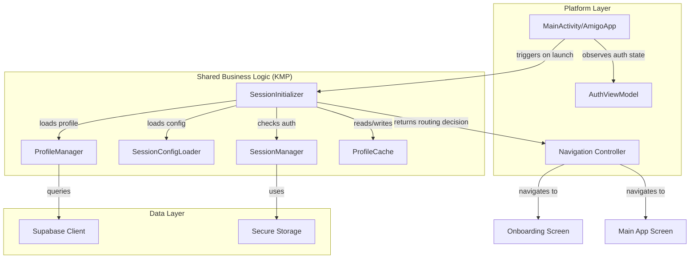
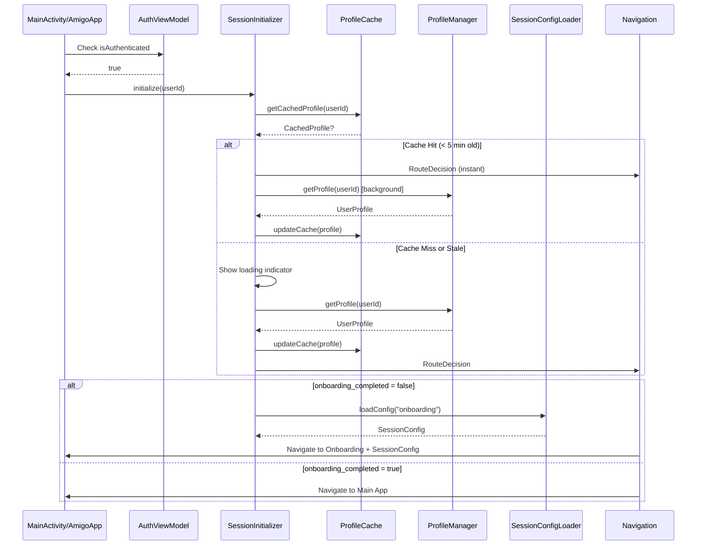
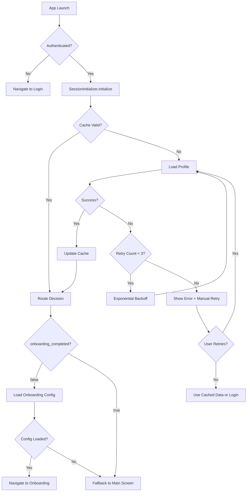

# Design Document: User Session Initialization

## Overview

This feature implements a robust session initialization system that automatically loads user profiles on app startup and routes authenticated users to the appropriate screen based on their onboarding completion status. The design leverages Kotlin Multiplatform for shared business logic while maintaining platform-specific UI implementations for Android (Jetpack Compose) and iOS (SwiftUI).

The SessionInitializer acts as the orchestrator between authentication state, profile data, and navigation decisions. When an authenticated user launches the app, the system:

1. Loads the user profile from Supabase via ProfileManager
2. Checks the onboarding_completed flag
3. Routes to either the conversational onboarding flow (Amigo chat with onboarding session) or the main app
4. Implements caching and retry logic for optimal performance and reliability

This design integrates seamlessly with existing components (ProfileManager, SessionConfigLoader, AuthViewModel) and follows established patterns in the codebase for authentication, data management, and navigation.

## Architecture

### High-Level Component Diagram



### Data Flow Sequence



### Error Handling Flow



## Components and Interfaces

### SessionInitializer (Shared - Kotlin Multiplatform)

The core component responsible for orchestrating session initialization logic.

```kotlin
package com.amigo.shared.session

import com.amigo.shared.data.models.UserProfile
import com.amigo.shared.profile.ProfileManager
import com.amigo.shared.ai.SessionConfigLoader
import com.amigo.shared.ai.SessionConfig
import kotlinx.coroutines.flow.MutableStateFlow
import kotlinx.coroutines.flow.StateFlow
import kotlinx.coroutines.delay

/**
 * Orchestrates user session initialization on app startup.
 * Loads user profile, determines routing based on onboarding status,
 * and manages caching for optimal performance.
 */
class SessionInitializer(
    private val profileManager: ProfileManager,
    private val profileCache: ProfileCache
) {
    private val _state = MutableStateFlow<InitializationState>(InitializationState.Idle)
    val state: StateFlow<InitializationState> = _state
    
    /**
     * Initialize session for authenticated user.
     * Returns routing decision based on onboarding status.
     */
    suspend fun initialize(userId: String): InitializationResult {
        _state.value = InitializationState.Loading
        
        // Check cache first
        val cachedProfile = profileCache.get(userId)
        if (cachedProfile != null && !cachedProfile.isStale()) {
            // Use cached data for instant routing
            val decision = determineRoute(cachedProfile.profile)
            _state.value = InitializationState.Success(decision)
            
            // Refresh in background
            refreshProfileInBackground(userId)
            
            return InitializationResult.Success(decision)
        }
        
        // Load profile with retry logic
        val profileResult = loadProfileWithRetry(userId)
        
        return when (profileResult) {
            is ProfileLoadResult.Success -> {
                profileCache.put(userId, profileResult.profile)
                val decision = determineRoute(profileResult.profile)
                _state.value = InitializationState.Success(decision)
                InitializationResult.Success(decision)
            }
            is ProfileLoadResult.Error -> {
                _state.value = InitializationState.Error(profileResult.error)
                InitializationResult.Error(profileResult.error)
            }
        }
    }
    
    private suspend fun loadProfileWithRetry(
        userId: String,
        maxRetries: Int = 3
    ): ProfileLoadResult {
        var attempt = 0
        var lastError: Exception? = null
        
        while (attempt < maxRetries) {
            try {
                val profile = profileManager.getProfileOrThrow(userId)
                return ProfileLoadResult.Success(profile)
            } catch (e: Exception) {
                lastError = e
                attempt++
                if (attempt < maxRetries) {
                    // Exponential backoff: 500ms, 1000ms, 2000ms
                    delay(500L * (1 shl (attempt - 1)))
                }
            }
        }
        
        return ProfileLoadResult.Error(
            lastError ?: Exception("Unknown error loading profile")
        )
    }
    
    private suspend fun refreshProfileInBackground(userId: String) {
        try {
            val profile = profileManager.getProfileOrThrow(userId)
            profileCache.put(userId, profile)
        } catch (e: Exception) {
            // Silent failure - we already have cached data
        }
    }
    
    private fun determineRoute(profile: UserProfile): RouteDecision {
        return if (profile.onboardingCompleted) {
            RouteDecision.MainApp
        } else {
            // Load onboarding session config
            val config = SessionConfigLoader.loadConfig("onboarding")
            RouteDecision.Onboarding(config)
        }
    }
    
    /**
     * Manually retry initialization after error.
     */
    suspend fun retry(userId: String): InitializationResult {
        return initialize(userId)
    }
}

sealed class InitializationState {
    object Idle : InitializationState()
    object Loading : InitializationState()
    data class Success(val decision: RouteDecision) : InitializationState()
    data class Error(val error: Exception) : InitializationState()
}

sealed class InitializationResult {
    data class Success(val decision: RouteDecision) : InitializationResult()
    data class Error(val error: Exception) : InitializationResult()
}

sealed class RouteDecision {
    object MainApp : RouteDecision()
    data class Onboarding(val config: SessionConfig?) : RouteDecision()
}

private sealed class ProfileLoadResult {
    data class Success(val profile: UserProfile) : ProfileLoadResult()
    data class Error(val error: Exception) : ProfileLoadResult()
}
```


### ProfileCache (Shared - Kotlin Multiplatform)

Manages in-memory caching of user profiles with TTL (time-to-live) for performance optimization.

```kotlin
package com.amigo.shared.session

import com.amigo.shared.data.models.UserProfile
import com.amigo.shared.utils.CurrentTime
import kotlinx.datetime.Instant
import kotlin.time.Duration.Companion.minutes

/**
 * In-memory cache for user profiles with TTL.
 * Reduces network calls and improves app startup performance.
 */
class ProfileCache {
    private val cache = mutableMapOf<String, CachedProfile>()
    private val ttl = 5.minutes // Cache valid for 5 minutes
    
    fun get(userId: String): CachedProfile? {
        return cache[userId]?.takeIf { !it.isStale() }
    }
    
    fun put(userId: String, profile: UserProfile) {
        cache[userId] = CachedProfile(
            profile = profile,
            timestamp = CurrentTime.now()
        )
    }
    
    fun clear(userId: String) {
        cache.remove(userId)
    }
    
    fun clearAll() {
        cache.clear()
    }
}

data class CachedProfile(
    val profile: UserProfile,
    val timestamp: Instant
) {
    fun isStale(): Boolean {
        val now = CurrentTime.now()
        val age = now - timestamp
        return age > 5.minutes
    }
}
```

### SessionInitializerFactory (Shared - Kotlin Multiplatform)

Factory for creating SessionInitializer instances with proper dependency injection.

```kotlin
package com.amigo.shared.session

import com.amigo.shared.profile.ProfileManager
import io.github.jan.supabase.SupabaseClient

object SessionInitializerFactory {
    private var instance: SessionInitializer? = null
    private val profileCache = ProfileCache()
    
    fun create(supabaseClient: SupabaseClient): SessionInitializer {
        return instance ?: synchronized(this) {
            instance ?: SessionInitializer(
                profileManager = ProfileManager(supabaseClient),
                profileCache = profileCache
            ).also { instance = it }
        }
    }
    
    fun getInstance(): SessionInitializer? = instance
}
```


### Android Integration

#### SessionInitializationViewModel (Android)

Platform-specific ViewModel that bridges SessionInitializer with Compose UI.

```kotlin
package com.amigo.android.session

import androidx.lifecycle.ViewModel
import androidx.lifecycle.viewModelScope
import com.amigo.shared.session.SessionInitializer
import com.amigo.shared.session.InitializationState
import com.amigo.shared.session.RouteDecision
import kotlinx.coroutines.flow.MutableStateFlow
import kotlinx.coroutines.flow.StateFlow
import kotlinx.coroutines.flow.asStateFlow
import kotlinx.coroutines.launch

class SessionInitializationViewModel(
    private val sessionInitializer: SessionInitializer
) : ViewModel() {
    
    private val _uiState = MutableStateFlow<SessionUiState>(SessionUiState.Idle)
    val uiState: StateFlow<SessionUiState> = _uiState.asStateFlow()
    
    fun initialize(userId: String) {
        viewModelScope.launch {
            sessionInitializer.state.collect { state ->
                _uiState.value = when (state) {
                    is InitializationState.Idle -> SessionUiState.Idle
                    is InitializationState.Loading -> SessionUiState.Loading
                    is InitializationState.Success -> {
                        when (state.decision) {
                            is RouteDecision.MainApp -> SessionUiState.NavigateToMain
                            is RouteDecision.Onboarding -> SessionUiState.NavigateToOnboarding(
                                state.decision.config
                            )
                        }
                    }
                    is InitializationState.Error -> SessionUiState.Error(
                        state.error.message ?: "Unknown error"
                    )
                }
            }
            
            sessionInitializer.initialize(userId)
        }
    }
    
    fun retry(userId: String) {
        viewModelScope.launch {
            sessionInitializer.retry(userId)
        }
    }
}

sealed class SessionUiState {
    object Idle : SessionUiState()
    object Loading : SessionUiState()
    object NavigateToMain : SessionUiState()
    data class NavigateToOnboarding(val config: com.amigo.shared.ai.SessionConfig?) : SessionUiState()
    data class Error(val message: String) : SessionUiState()
}
```

#### MainActivity Integration (Android)

Updated MainActivity to use SessionInitializer for routing decisions.

```kotlin
// In MainActivity.kt - Updated AmigoApp composable

@Composable
fun AmigoApp(viewModel: AuthViewModel) {
    val isAuthenticated by viewModel.isAuthenticated.collectAsState()
    val navController = rememberNavController()
    
    // Create session initializer
    val sessionInitializer = remember {
        SessionInitializerFactory.create(AuthFactory.getSupabaseClient())
    }
    
    val sessionViewModel = remember {
        SessionInitializationViewModel(sessionInitializer)
    }
    
    val sessionUiState by sessionViewModel.uiState.collectAsState()
    
    // Initialize session when authenticated
    LaunchedEffect(isAuthenticated) {
        if (isAuthenticated) {
            val user = viewModel.getCurrentUser()
            if (user != null) {
                sessionViewModel.initialize(user.id)
            }
        }
    }
    
    when {
        !isAuthenticated -> {
            // Show authentication screens
            NavHost(navController = navController, startDestination = "login") {
                composable("login") {
                    LoginScreen(
                        viewModel = viewModel,
                        onNavigateToSignUp = { navController.navigate("signup") }
                    )
                }
                composable("signup") {
                    SignUpScreen(
                        viewModel = viewModel,
                        onNavigateBack = { navController.popBackStack() }
                    )
                }
            }
        }
        sessionUiState is SessionUiState.Loading -> {
            // Show loading indicator
            LoadingScreen()
        }
        sessionUiState is SessionUiState.Error -> {
            // Show error with retry
            ErrorScreen(
                message = (sessionUiState as SessionUiState.Error).message,
                onRetry = {
                    val user = viewModel.getCurrentUser()
                    if (user != null) {
                        sessionViewModel.retry(user.id)
                    }
                }
            )
        }
        sessionUiState is SessionUiState.NavigateToOnboarding -> {
            // Show conversational onboarding
            val config = (sessionUiState as SessionUiState.NavigateToOnboarding).config
            val onboardingViewModel = remember {
                AgentConversationViewModel(
                    sessionManager = viewModel.sessionManager,
                    sessionConfig = config
                )
            }
            
            AgentConversationScreen(
                viewModel = onboardingViewModel,
                onComplete = {
                    // Refresh session state after onboarding
                    val user = viewModel.getCurrentUser()
                    if (user != null) {
                        sessionViewModel.initialize(user.id)
                    }
                }
            )
        }
        sessionUiState is SessionUiState.NavigateToMain -> {
            // Show main app
            MainScreen(
                authViewModel = viewModel,
                sessionManager = viewModel.sessionManager,
                onSignOut = {
                    kotlinx.coroutines.CoroutineScope(kotlinx.coroutines.Dispatchers.Main).launch {
                        viewModel.signOut()
                    }
                }
            )
        }
        else -> {
            // Idle state - show loading
            LoadingScreen()
        }
    }
}

@Composable
fun LoadingScreen() {
    Box(
        modifier = Modifier.fillMaxSize(),
        contentAlignment = Alignment.Center
    ) {
        CircularProgressIndicator()
    }
}

@Composable
fun ErrorScreen(message: String, onRetry: () -> Unit) {
    Column(
        modifier = Modifier
            .fillMaxSize()
            .padding(16.dp),
        horizontalAlignment = Alignment.CenterHorizontally,
        verticalArrangement = Arrangement.Center
    ) {
        Text(
            text = "Error loading profile",
            style = MaterialTheme.typography.headlineSmall
        )
        Spacer(modifier = Modifier.height(8.dp))
        Text(
            text = message,
            style = MaterialTheme.typography.bodyMedium,
            textAlign = TextAlign.Center
        )
        Spacer(modifier = Modifier.height(16.dp))
        Button(onClick = onRetry) {
            Text("Retry")
        }
    }
}
```


### iOS Integration

#### SessionInitializationViewModel (iOS)

Platform-specific ViewModel that bridges SessionInitializer with SwiftUI.

```swift
import SwiftUI
import shared
import Combine

@MainActor
class SessionInitializationViewModel: ObservableObject {
    @Published var uiState: SessionUiState = .idle
    
    private let sessionInitializer: SessionInitializer
    private var cancellables = Set<AnyCancellable>()
    
    init(sessionInitializer: SessionInitializer) {
        self.sessionInitializer = sessionInitializer
        observeState()
    }
    
    private func observeState() {
        // Observe Kotlin Flow from Swift
        Task {
            for await state in sessionInitializer.state {
                await MainActor.run {
                    switch state {
                    case is InitializationState.Idle:
                        uiState = .idle
                    case is InitializationState.Loading:
                        uiState = .loading
                    case let success as InitializationState.Success:
                        handleSuccess(success.decision)
                    case let error as InitializationState.Error:
                        uiState = .error(error.error.message ?? "Unknown error")
                    default:
                        break
                    }
                }
            }
        }
    }
    
    private func handleSuccess(_ decision: RouteDecision) {
        switch decision {
        case is RouteDecision.MainApp:
            uiState = .navigateToMain
        case let onboarding as RouteDecision.Onboarding:
            uiState = .navigateToOnboarding(onboarding.config)
        default:
            break
        }
    }
    
    func initialize(userId: String) {
        Task {
            do {
                _ = try await sessionInitializer.initialize(userId: userId)
            } catch {
                await MainActor.run {
                    uiState = .error(error.localizedDescription)
                }
            }
        }
    }
    
    func retry(userId: String) {
        Task {
            do {
                _ = try await sessionInitializer.retry(userId: userId)
            } catch {
                await MainActor.run {
                    uiState = .error(error.localizedDescription)
                }
            }
        }
    }
}

enum SessionUiState {
    case idle
    case loading
    case navigateToMain
    case navigateToOnboarding(SessionConfig?)
    case error(String)
}
```

#### AmigoApp Integration (iOS)

Updated AmigoApp to use SessionInitializer for routing decisions.

```swift
// In AmigoApp.swift - Updated body

var body: some Scene {
    WindowGroup {
        Group {
            if !hasCompletedWelcome {
                WelcomeView {
                    UserDefaults.standard.set(true, forKey: "hasCompletedWelcome")
                    hasCompletedWelcome = true
                }
            } else if !authViewModel.isAuthenticated {
                LoginView(viewModel: authViewModel)
            } else {
                SessionCoordinatorView(
                    authViewModel: authViewModel,
                    sessionManager: sessionManager
                )
            }
        }
        .onOpenURL { url in
            handleDeepLink(url)
        }
    }
}

struct SessionCoordinatorView: View {
    @StateObject private var sessionViewModel: SessionInitializationViewModel
    @ObservedObject var authViewModel: AuthViewModel
    let sessionManager: SessionManager
    
    init(authViewModel: AuthViewModel, sessionManager: SessionManager) {
        self.authViewModel = authViewModel
        self.sessionManager = sessionManager
        
        let supabaseClient = AuthFactory.shared.getSupabaseClient()
        let sessionInitializer = SessionInitializerFactory.shared.create(supabaseClient: supabaseClient)
        _sessionViewModel = StateObject(wrappedValue: SessionInitializationViewModel(
            sessionInitializer: sessionInitializer
        ))
    }
    
    var body: some View {
        Group {
            switch sessionViewModel.uiState {
            case .idle, .loading:
                LoadingView()
            case .error(let message):
                ErrorView(message: message) {
                    if let userId = try? await authViewModel.getCurrentUser()?.id {
                        sessionViewModel.retry(userId: userId)
                    }
                }
            case .navigateToOnboarding(let config):
                ConversationalOnboardingView(
                    sessionManager: sessionManager,
                    sessionConfig: config,
                    onComplete: {
                        // Refresh session state
                        if let userId = try? await authViewModel.getCurrentUser()?.id {
                            sessionViewModel.initialize(userId: userId)
                        }
                    }
                )
            case .navigateToMain:
                MainTabView(viewModel: authViewModel)
            }
        }
        .task {
            // Initialize session when view appears
            if let userId = try? await authViewModel.getCurrentUser()?.id {
                sessionViewModel.initialize(userId: userId)
            }
        }
    }
}

struct LoadingView: View {
    var body: some View {
        VStack {
            ProgressView()
            Text("Loading your profile...")
                .font(.subheadline)
                .foregroundColor(.secondary)
                .padding(.top, 8)
        }
    }
}

struct ErrorView: View {
    let message: String
    let onRetry: () async -> Void
    
    var body: some View {
        VStack(spacing: 16) {
            Image(systemName: "exclamationmark.triangle")
                .font(.system(size: 48))
                .foregroundColor(.orange)
            
            Text("Error Loading Profile")
                .font(.headline)
            
            Text(message)
                .font(.subheadline)
                .foregroundColor(.secondary)
                .multilineTextAlignment(.center)
                .padding(.horizontal)
            
            Button(action: {
                Task {
                    await onRetry()
                }
            }) {
                Text("Retry")
                    .frame(maxWidth: 200)
            }
            .buttonStyle(.borderedProminent)
        }
        .padding()
    }
}
```


## Data Models

### UserProfile (Existing)

The existing UserProfile model already contains the necessary fields for session initialization:

```kotlin
@Serializable
data class UserProfile(
    val id: String,
    val email: String,
    @SerialName("display_name") val displayName: String? = null,
    @SerialName("avatar_url") val avatarUrl: String? = null,
    val age: Int? = null,
    @SerialName("height_cm") val heightCm: Double? = null,
    @SerialName("weight_kg") val weightKg: Double? = null,
    @SerialName("goal_type") val goalType: String? = null,
    @SerialName("goal_by_when") val goalByWhen: String? = null,
    @SerialName("activity_level") val activityLevel: String? = null,
    @SerialName("dietary_preferences") val dietaryPreferences: List<String>? = null,
    @SerialName("unit_preference") val unitPreference: String? = null,
    val theme: String? = null,
    @SerialName("onboarding_completed") val onboardingCompleted: Boolean = false,
    @SerialName("onboarding_completed_at") val onboardingCompletedAt: String? = null,
    @SerialName("created_at") val createdAt: String,
    @SerialName("updated_at") val updatedAt: String
)
```

Key field for session initialization:
- `onboardingCompleted`: Boolean flag determining routing decision

### SessionConfig (Existing)

The existing SessionConfig model is used for loading onboarding configuration:

```kotlin
@Serializable
data class SessionConfig(
    val cap: String,
    val responsibilities: List<String>,
    @SerialName("collect_data") val collectData: List<String>,
    @SerialName("collect_metrics") val collectMetrics: List<String>,
    @SerialName("conversation_style") val conversationStyle: String,
    @SerialName("success_criteria") val successCriteria: List<String>
)
```

The "onboarding" session config will be loaded via SessionConfigLoader when routing to onboarding.


## Correctness Properties

*A property is a characteristic or behavior that should hold true across all valid executions of a system—essentially, a formal statement about what the system should do. Properties serve as the bridge between human-readable specifications and machine-verifiable correctness guarantees.*

### Property Reflection

After analyzing all acceptance criteria, I identified the following redundancies:

- Properties 1.1 and 1.2 (profile retrieval and status extraction) can be combined into a single property about successful initialization returning the correct routing decision
- Properties 2.1 and 2.2 (routing based on onboarding status) are already covered by the combined property above
- Property 2.4 (routing occurs after profile load) is implicit in the initialize function's return value
- Properties 7.1 and 7.2 (caching and background refresh) can be combined into a single property about cache behavior

### Property 1: Profile Load Triggers Correct Routing Decision

*For any* authenticated user ID and user profile, when SessionInitializer.initialize() is called, the returned routing decision should match the profile's onboarding_completed status (false → Onboarding route, true → MainApp route).

**Validates: Requirements 1.1, 1.2, 2.1, 2.2, 2.4**

### Property 2: Profile Load Failure Results in Error State

*For any* user ID where profile loading fails, SessionInitializer.initialize() should return an Error result and emit an Error state.

**Validates: Requirements 1.3**

### Property 3: Loading State Emitted During Initialization

*For any* user ID, when SessionInitializer.initialize() is called, the state flow should emit Loading state before completion.

**Validates: Requirements 1.5**

### Property 4: Onboarding Route Includes Session Config

*For any* profile with onboarding_completed=false, the routing decision should include a SessionConfig loaded from SessionConfigLoader.

**Validates: Requirements 2.3**

### Property 5: State Updates Are Observable

*For any* initialization attempt, state changes (Idle → Loading → Success/Error) should be emitted through the state flow in the correct sequence.

**Validates: Requirements 5.5**

### Property 6: Retry Logic with Exponential Backoff

*For any* user ID where profile loading fails, SessionInitializer should retry up to 3 times with exponential backoff delays (500ms, 1000ms, 2000ms) before returning an error.

**Validates: Requirements 6.2**

### Property 7: Error State After Max Retries

*For any* user ID where all 3 retry attempts fail, SessionInitializer.initialize() should return Error result with the last exception.

**Validates: Requirements 6.3**

### Property 8: Manual Retry Re-attempts Load

*For any* user ID in error state, calling SessionInitializer.retry() should trigger a new profile load attempt with fresh retry counter.

**Validates: Requirements 6.4**

### Property 9: Fallback to Main App When Config Load Fails

*For any* profile with onboarding_completed=false where SessionConfigLoader returns null, the routing decision should be MainApp (fallback behavior).

**Validates: Requirements 6.5**

### Property 10: Cache Hit Enables Instant Routing

*For any* user ID with valid cached profile (age < 5 minutes), SessionInitializer.initialize() should return a routing decision immediately using cached data, then refresh in background.

**Validates: Requirements 7.1, 7.2**

### Property 11: Cache Miss Triggers Fresh Load

*For any* user ID without cached profile or with stale cache (age ≥ 5 minutes), SessionInitializer.initialize() should load profile from ProfileManager before returning routing decision.

**Validates: Requirements 7.1**


## Error Handling

### Error Categories

1. **Network Errors**: Connection failures, timeouts during profile loading
   - Strategy: Retry with exponential backoff (3 attempts)
   - User Experience: Show loading indicator, then error with retry button

2. **Authentication Errors**: Invalid or expired session tokens
   - Strategy: Delegate to SessionManager/AuthViewModel
   - User Experience: Redirect to login screen

3. **Data Errors**: Profile not found, malformed data
   - Strategy: Log error, return Error result
   - User Experience: Show error message with retry option

4. **Configuration Errors**: SessionConfig fails to load
   - Strategy: Fallback to MainApp route (graceful degradation)
   - User Experience: User proceeds to main app, onboarding skipped

### Error Recovery Mechanisms

#### Retry with Exponential Backoff

```kotlin
private suspend fun loadProfileWithRetry(
    userId: String,
    maxRetries: Int = 3
): ProfileLoadResult {
    var attempt = 0
    var lastError: Exception? = null
    
    while (attempt < maxRetries) {
        try {
            val profile = profileManager.getProfileOrThrow(userId)
            return ProfileLoadResult.Success(profile)
        } catch (e: Exception) {
            lastError = e
            attempt++
            if (attempt < maxRetries) {
                // Exponential backoff: 500ms, 1000ms, 2000ms
                delay(500L * (1 shl (attempt - 1)))
            }
        }
    }
    
    return ProfileLoadResult.Error(
        lastError ?: Exception("Unknown error loading profile")
    )
}
```

#### Graceful Degradation

When SessionConfig fails to load for onboarding:

```kotlin
private fun determineRoute(profile: UserProfile): RouteDecision {
    return if (profile.onboardingCompleted) {
        RouteDecision.MainApp
    } else {
        val config = SessionConfigLoader.loadConfig("onboarding")
        if (config != null) {
            RouteDecision.Onboarding(config)
        } else {
            // Fallback: proceed to main app even though onboarding not complete
            Logger.w("SessionInitializer", "Failed to load onboarding config, falling back to main app")
            RouteDecision.MainApp
        }
    }
}
```

#### Cache Fallback

When fresh profile load fails but cache exists:

```kotlin
suspend fun initialize(userId: String): InitializationResult {
    // ... cache check logic ...
    
    val profileResult = loadProfileWithRetry(userId)
    
    return when (profileResult) {
        is ProfileLoadResult.Success -> {
            // Normal success path
        }
        is ProfileLoadResult.Error -> {
            // Check if we have stale cache as fallback
            val staleCache = profileCache.get(userId)
            if (staleCache != null) {
                Logger.w("SessionInitializer", "Using stale cache as fallback")
                val decision = determineRoute(staleCache.profile)
                _state.value = InitializationState.Success(decision)
                InitializationResult.Success(decision)
            } else {
                _state.value = InitializationState.Error(profileResult.error)
                InitializationResult.Error(profileResult.error)
            }
        }
    }
}
```

### Logging Strategy

All errors are logged with appropriate severity levels:

- **ERROR**: Profile load failures, authentication issues
- **WARN**: Config load failures, using stale cache
- **INFO**: Successful initialization, cache hits
- **DEBUG**: Retry attempts, state transitions

Example logging:

```kotlin
Logger.e("SessionInitializer", "Failed to load profile for user $userId: ${e.message}")
Logger.w("SessionInitializer", "Retry attempt $attempt of $maxRetries")
Logger.i("SessionInitializer", "Cache hit for user $userId, age: ${cacheAge}ms")
```


## Testing Strategy

### Dual Testing Approach

This feature requires both unit tests and property-based tests for comprehensive coverage:

- **Unit tests**: Verify specific examples, edge cases, and integration points
- **Property tests**: Verify universal properties across all inputs using randomization

### Unit Testing

Unit tests focus on specific scenarios and edge cases:

**Shared Logic Tests (Kotlin)**

```kotlin
class SessionInitializerTest {
    @Test
    fun `initialize with completed onboarding returns MainApp route`() = runTest {
        val profile = UserProfile(
            id = "user123",
            email = "test@example.com",
            onboardingCompleted = true,
            // ... other fields
        )
        val mockProfileManager = mockk<ProfileManager> {
            coEvery { getProfileOrThrow("user123") } returns profile
        }
        val cache = ProfileCache()
        val initializer = SessionInitializer(mockProfileManager, cache)
        
        val result = initializer.initialize("user123")
        
        assertTrue(result is InitializationResult.Success)
        assertTrue((result as InitializationResult.Success).decision is RouteDecision.MainApp)
    }
    
    @Test
    fun `initialize with incomplete onboarding returns Onboarding route`() = runTest {
        // Similar test for onboarding_completed = false
    }
    
    @Test
    fun `initialize with network error retries 3 times`() = runTest {
        val mockProfileManager = mockk<ProfileManager> {
            coEvery { getProfileOrThrow(any()) } throws IOException("Network error")
        }
        val cache = ProfileCache()
        val initializer = SessionInitializer(mockProfileManager, cache)
        
        val result = initializer.initialize("user123")
        
        assertTrue(result is InitializationResult.Error)
        coVerify(exactly = 3) { mockProfileManager.getProfileOrThrow("user123") }
    }
    
    @Test
    fun `cache hit returns instant result and refreshes in background`() = runTest {
        // Test cache behavior
    }
    
    @Test
    fun `stale cache triggers fresh load`() = runTest {
        // Test stale cache behavior
    }
}
```

**Platform-Specific Tests**

Android ViewModel tests:

```kotlin
class SessionInitializationViewModelTest {
    @Test
    fun `initialize emits Loading then Success states`() = runTest {
        // Test state flow emissions
    }
    
    @Test
    fun `retry after error re-attempts initialization`() = runTest {
        // Test retry behavior
    }
}
```

iOS ViewModel tests:

```swift
class SessionInitializationViewModelTests: XCTestCase {
    func testInitializeEmitsLoadingThenSuccessStates() async {
        // Test state flow emissions
    }
    
    func testRetryAfterErrorReAttemptsInitialization() async {
        // Test retry behavior
    }
}
```

### Property-Based Testing

Property tests verify universal behaviors across randomized inputs. Each test runs a minimum of 100 iterations.

**Library Selection**:
- Kotlin: [Kotest Property Testing](https://kotest.io/docs/proptest/property-based-testing.html)
- Swift: [swift-check](https://github.com/typelift/SwiftCheck)

**Property Test Configuration**:

```kotlin
// In shared/build.gradle.kts
dependencies {
    testImplementation("io.kotest:kotest-property:5.8.0")
    testImplementation("io.kotest:kotest-runner-junit5:5.8.0")
}
```

**Property Test Examples**:

```kotlin
class SessionInitializerPropertyTest : StringSpec({
    
    "Property 1: Profile load triggers correct routing decision" {
        // Feature: user-session-initialization, Property 1: For any authenticated user ID and user profile, when SessionInitializer.initialize() is called, the returned routing decision should match the profile's onboarding_completed status
        checkAll(100, Arb.string(), Arb.bool()) { userId, onboardingCompleted ->
            val profile = generateRandomProfile(userId, onboardingCompleted)
            val mockProfileManager = mockk<ProfileManager> {
                coEvery { getProfileOrThrow(userId) } returns profile
            }
            val cache = ProfileCache()
            val initializer = SessionInitializer(mockProfileManager, cache)
            
            val result = initializer.initialize(userId)
            
            result shouldBe instanceOf<InitializationResult.Success>()
            val decision = (result as InitializationResult.Success).decision
            
            if (onboardingCompleted) {
                decision shouldBe instanceOf<RouteDecision.MainApp>()
            } else {
                decision shouldBe instanceOf<RouteDecision.Onboarding>()
            }
        }
    }
    
    "Property 2: Profile load failure results in error state" {
        // Feature: user-session-initialization, Property 2: For any user ID where profile loading fails, SessionInitializer.initialize() should return an Error result
        checkAll(100, Arb.string()) { userId ->
            val mockProfileManager = mockk<ProfileManager> {
                coEvery { getProfileOrThrow(userId) } throws IOException("Network error")
            }
            val cache = ProfileCache()
            val initializer = SessionInitializer(mockProfileManager, cache)
            
            val result = initializer.initialize(userId)
            
            result shouldBe instanceOf<InitializationResult.Error>()
        }
    }
    
    "Property 6: Retry logic with exponential backoff" {
        // Feature: user-session-initialization, Property 6: For any user ID where profile loading fails, SessionInitializer should retry up to 3 times
        checkAll(100, Arb.string()) { userId ->
            var callCount = 0
            val mockProfileManager = mockk<ProfileManager> {
                coEvery { getProfileOrThrow(userId) } answers {
                    callCount++
                    throw IOException("Network error")
                }
            }
            val cache = ProfileCache()
            val initializer = SessionInitializer(mockProfileManager, cache)
            
            initializer.initialize(userId)
            
            callCount shouldBe 3
        }
    }
    
    "Property 10: Cache hit enables instant routing" {
        // Feature: user-session-initialization, Property 10: For any user ID with valid cached profile, initialize should return immediately
        checkAll(100, Arb.string(), Arb.bool()) { userId, onboardingCompleted ->
            val profile = generateRandomProfile(userId, onboardingCompleted)
            val mockProfileManager = mockk<ProfileManager>()
            val cache = ProfileCache()
            cache.put(userId, profile)
            val initializer = SessionInitializer(mockProfileManager, cache)
            
            val startTime = System.currentTimeMillis()
            val result = initializer.initialize(userId)
            val duration = System.currentTimeMillis() - startTime
            
            result shouldBe instanceOf<InitializationResult.Success>()
            duration shouldBeLessThan 100 // Should be nearly instant
        }
    }
})

fun generateRandomProfile(userId: String, onboardingCompleted: Boolean): UserProfile {
    return UserProfile(
        id = userId,
        email = "${userId}@example.com",
        onboardingCompleted = onboardingCompleted,
        createdAt = CurrentTime.nowIso8601(),
        updatedAt = CurrentTime.nowIso8601()
    )
}
```

### Integration Testing

Integration tests verify end-to-end flows:

1. **Android Integration**: Test MainActivity → SessionInitializer → Navigation
2. **iOS Integration**: Test AmigoApp → SessionInitializer → Navigation
3. **Supabase Integration**: Test actual profile loading from Supabase (using test database)

### Test Coverage Goals

- **Shared Logic**: 90%+ code coverage
- **Platform ViewModels**: 80%+ code coverage
- **Property Tests**: All 11 properties implemented
- **Unit Tests**: All edge cases and error paths covered

### Continuous Integration

All tests run on:
- Pull request creation
- Merge to main branch
- Nightly builds

Test failures block merges to main branch.


## Implementation Notes

### Dependencies

**Shared Module (Kotlin Multiplatform)**:
- `com.amigo.shared.profile.ProfileManager` - Existing component for profile operations
- `com.amigo.shared.ai.SessionConfigLoader` - Existing component for loading session configs
- `com.amigo.shared.auth.SessionManager` - Existing component for session management
- `kotlinx-coroutines` - For async operations and Flow
- `kotlinx-datetime` - For timestamp handling in cache

**Android**:
- `androidx.lifecycle.ViewModel` - For SessionInitializationViewModel
- `androidx.compose.runtime` - For state management in Compose
- `androidx.navigation.compose` - For navigation

**iOS**:
- `SwiftUI` - For UI and state management
- `Combine` - For observing Kotlin Flow from Swift

### File Locations

Following the project structure conventions:

```
mobile/shared/src/commonMain/kotlin/com/amigo/shared/
├── session/
│   ├── SessionInitializer.kt
│   ├── ProfileCache.kt
│   └── SessionInitializerFactory.kt

mobile/android/src/main/java/com/amigo/android/
├── session/
│   └── SessionInitializationViewModel.kt
├── MainActivity.kt (updated)

mobile/ios/Amigo/
├── Session/
│   └── SessionInitializationViewModel.swift
├── AmigoApp.swift (updated)
```

### Migration Strategy

This feature enhances existing authentication flow without breaking changes:

1. **Phase 1**: Implement shared SessionInitializer and ProfileCache
2. **Phase 2**: Integrate into Android MainActivity
3. **Phase 3**: Integrate into iOS AmigoApp
4. **Phase 4**: Remove old onboarding status checks from SharedPreferences/UserDefaults

### Performance Considerations

**Cache TTL**: 5 minutes balances freshness with performance
- Short enough to reflect recent profile changes
- Long enough to avoid unnecessary network calls

**Background Refresh**: When cache is used, profile refreshes in background
- User gets instant routing
- Fresh data loaded for next interaction

**Retry Strategy**: Exponential backoff prevents overwhelming the server
- 500ms, 1000ms, 2000ms delays
- Total max delay: 3.5 seconds before giving up

### Security Considerations

**Authentication**: SessionInitializer assumes user is already authenticated
- AuthViewModel handles session validation
- SessionManager provides access tokens for API calls

**Data Privacy**: Profile data cached in memory only
- No sensitive data persisted to disk
- Cache cleared on sign out

**Error Messages**: Generic error messages to users
- Detailed errors logged for debugging
- No exposure of internal system details

### Future Enhancements

1. **Persistent Cache**: Store encrypted profile in secure storage for offline support
2. **Prefetching**: Load profile during authentication flow to eliminate startup delay
3. **Analytics**: Track initialization success rates and performance metrics
4. **A/B Testing**: Test different cache TTL values for optimal UX
5. **Progressive Loading**: Show partial UI while profile loads in background

## Summary

This design implements a robust session initialization system that:

- Loads user profiles automatically on app startup
- Routes users based on onboarding completion status
- Implements intelligent caching for instant startup
- Handles errors gracefully with retry logic and fallbacks
- Maintains shared business logic in Kotlin Multiplatform
- Integrates seamlessly with existing authentication and navigation patterns

The design prioritizes user experience (fast startup, clear error handling) while maintaining code quality (testable, maintainable, well-documented). Property-based testing ensures correctness across all input scenarios, while unit tests cover specific edge cases and integration points.
